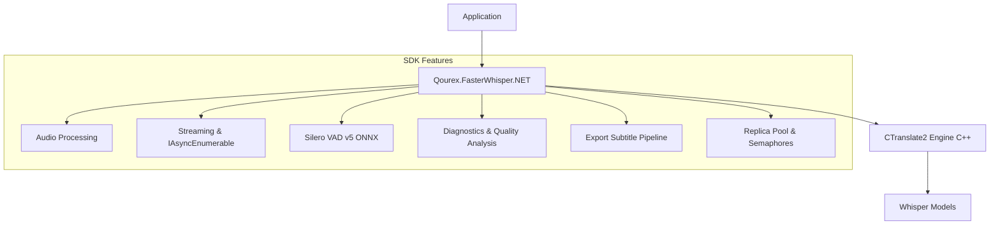

<p align="center">
  
</p>

# Qourex.FasterWhisper.NET

<p align="center">
  <strong>by <a href="https://qourex.com">Qourex</a></strong> — Bringing high-performance speech recognition to .NET
</p>

<p align="center">
  <a href="https://github.com/qourex/fasterwhisper.net/actions/workflows/build.yml"></a>
  <a href="https://www.nuget.org/packages/Qourex.FasterWhisper.NET"></a>
  <a href="https://www.nuget.org/packages/Qourex.FasterWhisper.NET"></a>
  <a href="LICENSE"></a>
  <a href="https://dotnet.microsoft.com"></a>
</p>

---

**Qourex.FasterWhisper.NET** is a production-ready .NET SDK for OpenAI Whisper built on top of the high-performance **CTranslate2** inference engine.

The project brings Whisper transcription, streaming, batching, diagnostics, audio analysis, subtitle generation, and deployment-focused tooling to modern .NET applications while remaining fully compatible with the CTranslate2 ecosystem.

---

## ❓ Why Qourex.FasterWhisper.NET?

Qourex.FasterWhisper.NET focuses on delivering a complete, optimized .NET developer experience around Whisper inference. Key capabilities include:

- **🔌 Native .NET API Surface** — Elegant, idiomatic C# builder and async patterns.
- **⚡ CTranslate2-Powered Inference** — High-performance inference powered by CTranslate2.
- **👥 Shared-Weight Replica Pools** — Concurrent transcription powered by CTranslate2 replica pools that share underlying model weights.
- **🔄 Streaming Transcription** — Real-time audio streaming powered by an async-push pipeline.
- **🗣️ Voice Activity Detection (VAD)** — Fast, robust Silero VAD v5 ONNX integration.
- **📈 Audio Quality Assessment** — Built-in non-intrusive analyzer to grade audio signal quality before transcription.
- **🔍 Hallucination Diagnostics** — Identifies repetitive loops and blank segments.
- **📦 Batched Inference Pipelines** — Concurrently processes partitioned segments for high throughput.
- **📊 Rich Profiling and Benchmarking** — Integrated resource performance metrics (CPU RAM/GPU VRAM/RTF).
- **📝 Export Pipelines** — Formats segments directly into SRT, WebVTT, TSV, or JSON subtitles.
- **✅ Extensive Automated Test Coverage** — Robust test suite validating all interop and wrapper features.

---

## ⚖️ Ecosystem Positioning

Qourex.FasterWhisper.NET and Python's `faster-whisper` both leverage the high-performance CTranslate2 inference engine under the hood. 

- **`faster-whisper`** provides an excellent Python-first experience and has become one of the most widely adopted Whisper implementations in the machine learning ecosystem.
- **`Qourex.FasterWhisper.NET`** focuses on the .NET ecosystem by providing:
  - Native C# APIs (fully typed, thread-safe, and disposable)
  - Async-first design (native `async/await` and `IAsyncEnumerable<T>`)
  - Seamless integration with ASP.NET Core, desktop apps, and enterprise .NET pipelines
  - Built-in host diagnostics, profiling, and quality analysis
  - Extended export format pipelines and subtitle rendering utilities
  - Deployment-oriented cross-platform packaging

---

## 🏥 Project Health

| Metric | Value |
| :--- | :--- |
| **Unit Tests** | 152 |
| **Native Backend** | CTranslate2 C++ |
| **License** | MIT |
| **Target Frameworks** | .NET 8.0, .NET 9.0, .NET 10.0 |
| **Supported OS** | Windows (x64), Linux (x64), macOS (x64, ARM64) |
| **Languages** | C#, C++, CUDA |

---

## 🎯 Feature Matrix

| Capability | Support |
| :--- | :---: |
| **Streaming Transcription** | ✅ |
| **Voice Activity Detection (VAD)** | ✅ |
| **Batched Inference Pipelines** | ✅ |
| **Shared Replica Pools** | ✅ |
| **Audio Quality Analysis** | ✅ |
| **Hallucination Diagnostics** | ✅ |
| **Subtitle & Transcript Export** | ✅ |
| **Profiling & Benchmarking** | ✅ |
| **Memory-Mapped Loading** | ✅ |

---

## 📐 Architecture

Below is a high-level overview of the library's architecture:



---

## ✨ Features

- **⚡ High-Performance Inference** — Powered by CTranslate2 with INT8 / FP16 / INT16 quantization
- **🎮 GPU & CPU Acceleration** — NVIDIA CUDA + cuDNN for GPU, Intel MKL-optimized CPU threads
- **📥 Automatic Model Downloader** — Downloads converted CTranslate2 models from Hugging Face Hub
- **🔄 Streaming Transcription** — Real-time `IAsyncEnumerable` transcription with VAD-based segmentation
- **🗣️ Silero VAD Integration** — Voice Activity Detection via ONNX Runtime to eliminate silence hallucinations
- **📝 Word-Level Timestamps** — Cross-attention alignment for precise per-word timing
- **🌍 Language Detection** — Auto-detect from 99+ languages with confidence scores
- **🎵 Audio Processing Pipeline** — RMS normalization, high-pass filtering, spectral noise gate, Lanczos resampler, multi-format WAV decoder (8/16/24/32-bit PCM, IEEE float, A-law, μ-law)
- **🔧 Text Post-Processing** — Filler word filtering, stutter pruning, context-conditioned decoding
- **💻 Cross-Platform** — Native runtimes pre-compiled for Windows (win-x64), Linux (linux-x64), and macOS (osx-x64, osx-arm64 for Apple Silicon)
- **📦 Multi-Target** — Out-of-the-box support for `.NET 8.0`, `.NET 9.0`, and `.NET 10.0`

---

## 📋 Table of Contents

- [Why Qourex.FasterWhisper.NET?](#-why-qourexfasterwhispernet)
- [Ecosystem Positioning](#-ecosystem-positioning)
- [Project Health](#-project-health)
- [Feature Matrix](#-feature-matrix)
- [Architecture](#-architecture)
- [Features](#-features)
- [Installation](#-installation)
- [Quick Start](#-quick-start)
- [Available Models](#-available-models)
- [Performance Benchmarks](#-performance-benchmarks)
- [Advanced Usage](#-advanced-usage)
  - [Fluent Model Builder](#fluent-model-builder)
  - [Concurrency & Multi-Replica](#concurrency--multi-replica)
  - [Batched Inference Pipeline](#batched-inference-pipeline)
  - [Word-Level Timestamps](#word-level-timestamps)
  - [Streaming Transcription](#streaming-transcription)
  - [Voice Activity Detection (VAD)](#voice-activity-detection-vad)
  - [In-Memory Model Loading](#in-memory-model-loading)
  - [Language Detection](#language-detection)
  - [Audio Processing Options](#audio-processing-options)
  - [Audio Quality Assessment](#audio-quality-assessment)
  - [Text Post-Processing](#text-post-processing)
  - [Subtitle & Export Formats](#subtitle--export-formats)
- [Common Use Cases](#-common-use-cases)
- [Automated Testing](#-automated-testing)
- [API Reference](#-api-reference)
  - [WhisperOptions](#whisperoptions)
  - [VadOptions](#vadoptions)
  - [WhisperSegment](#whispersegment)
  - [WhisperWord](#whisperword)
- [Building from Source](#-building-from-source)
- [CUDA Prerequisites](#-cuda-prerequisites)
- [Project Structure](#-project-structure)
- [License](#-license)

---

## 📦 Installation

```bash
dotnet add package Qourex.FasterWhisper.NET
```

Or via the Package Manager Console:

```powershell
Install-Package Qourex.FasterWhisper.NET
```

> [!NOTE]
> The NuGet package ships with pre-compiled native binaries for **Windows (win-x64)**, **Linux (linux-x64)**, and **macOS (osx-x64, osx-arm64)** out of the box. For GPU acceleration, see [CUDA Prerequisites](#-cuda-prerequisites).

---

## 🚀 Quick Start

> [!NOTE]
> **Concurrency & Thread-Safety:** `WhisperModel` supports concurrent transcription calls. Under the hood, concurrent calls are queued and processed safely using a `SemaphoreSlim`. If you configure the model with `NumReplicas > 1`, transcription calls will execute concurrently utilizing CTranslate2's native thread-safe replica pool, sharing the same loaded model weights in memory to minimize additional memory overhead.

```csharp
using Qourex.FasterWhisper.NET;

// 1. Download and load the model (cached to ~/.cache/qourex-fasterwhisper)
using var model = await WhisperModel.LoadAsync(
    modelNameOrPath: "base",       // "tiny", "base", "small", "medium", "large-v3", etc.
    device:          "cpu",        // "cpu" or "cuda"
    computeType:     "default"     // "float32", "float16", "int8", "int8_float16", etc.
);

// 2. Configure transcription options
var options = new WhisperOptions
{
    BeamSize = 5,
    WordTimestamps = false
};

// 3. Configure Voice Activity Detection (optional)
var vadOptions = new VadOptions
{
    Enabled   = true,
    Threshold = 0.5f
};

// 4. Transcribe — supports WAV, MP3, MP4, Opus (FFmpeg fallback)
var segments = model.Transcribe(
    mediaPath:  "audio.wav",
    language:   "en",           // pass null for auto-detection
    options:    options,
    vadOptions: vadOptions
);

// 5. Display results
foreach (var segment in segments)
{
    Console.WriteLine($"[{segment.Start:F2}s -> {segment.End:F2}s] {segment.Text}");
}
```

---

## 🤖 Available Models

Models are automatically downloaded from the [Hugging Face Hub](https://huggingface.co) on first use and cached locally.

| Model | Parameters | Size on Disk | Approx. VRAM (FP16) | Relative Speed | Best For |
|:------|:----------:|:------------:|:--------------------:|:--------------:|:---------|
| `tiny` | 39 M | ~75 MB | ~1 GB | Fastest | Quick prototyping, edge devices |
| `base` | 74 M | ~142 MB | ~1 GB | Very Fast | Lightweight applications |
| `small` | 244 M | ~466 MB | ~2 GB | Fast | Good accuracy/speed balance |
| `medium` | 769 M | ~1.5 GB | ~5 GB | Moderate | High accuracy |
| `large-v1` | 1550 M | ~3.1 GB | ~10 GB | Slow | Maximum accuracy (v1) |
| `large-v2` | 1550 M | ~3.1 GB | ~10 GB | Slow | Maximum accuracy (v2) |
| `large-v3` | 1550 M | ~3.1 GB | ~10 GB | Slow | Best overall accuracy |
| `large-v3-turbo` | 809 M | ~1.6 GB | ~3 GB | Fast | Great accuracy/speed trade-off |
| `faster-distil-whisper-large-v3` | 756 M | ~1.5 GB | ~3 GB | Fast | Excellent English-only speed & accuracy |

### Devices & Compute Types

| Device | Description |
|:-------|:------------|
| `"cpu"` | CPU execution with Intel MKL optimization |
| `"cuda"` | NVIDIA GPU via CUDA (requires CUDA Toolkit + cuDNN) |

| Compute Type | Description |
|:-------------|:------------|
| `"default"` | Automatically selects the best type for the device |
| `"float32"` | Full 32-bit floating point precision |
| `"float16"` | Half precision — faster on GPU, lower memory |
| `"int8"` | 8-bit integer quantization — fastest, smallest footprint |
| `"int8_float16"` | Mixed INT8 compute with FP16 storage |
| `"int16"` | 16-bit integer quantization |

---

## 📊 Performance Benchmarks

Below are the results of the performance and resource footprint benchmarks run using the console samples.

### Running the Benchmarks

The benchmark runner is built directly into the repository's sample CLI tool. You can run these exact performance tests on your own machine using the following commands:

```bash
# Run on CPU with 'tiny' model and standard harvard.wav
dotnet run --project samples/Qourex.FasterWhisper.NET.Samples/Qourex.FasterWhisper.NET.Samples.csproj -- benchmark cpu tiny harvard.wav

# Run on GPU (CUDA) with 'faster-distil-whisper-large-v3' and custom audio
dotnet run --project samples/Qourex.FasterWhisper.NET.Samples/Qourex.FasterWhisper.NET.Samples.csproj -p:UseGpuTest=true -- benchmark cuda faster-distil-whisper-large-v3 harvard.wav
```

### Benchmark Environment

- **CPU**: Intel Core i7-4790 (4 Cores / 8 Threads)
- **RAM**: 32 GB DDR3
- **GPU**: NVIDIA GeForce GTX 1070 Ti (8 GB VRAM)
- **CUDA**: 12.4 / cuDNN 9.1
- **OS**: Windows 11 Pro
- **Model**: `faster-distil-whisper-large-v3` (756 million parameters)
- **Audio Length**: 972.29 seconds (16.2 minutes)

### Memory & Startup Overhead (Standard vs Memory-Mapped)

Memory-mapped loading can reduce model initialization time and may be beneficial for CPU-based deployments. 

For CUDA deployments, standard path-based loading may provide lower steady-state host memory usage because model weights are uploaded to GPU memory and temporary host buffers can be released. 

Choose the loading strategy that best fits your deployment environment.

| Loading Strategy | Load Time | CPU RAM Delta | GPU VRAM Delta | Startup Speedup |
| :--- | :---: | :---: | :---: | :---: |
| **Standard Load (No-Mmap)** | 3,172.8 ms | 110.1 MB | 3,814.0 MB | Baseline |
| **Memory-Mapped Load** | 2,506.2 ms | 963.1 MB | 3,713.0 MB | **1.27x** |

> [!NOTE]
> Standard loading registers a lower C# process working set (`CPU RAM Delta`) because model loading is fully delegated to the native C++ heap. Memory-mapped loading allocates virtual memory buffers within C# before passing pinned pointers to C++, which is reflected in C# working set statistics.

### Multi-Replica Resource Scaling (Shared weights in memory)

When scaling the number of concurrent execution threads via `NumReplicas` within the same process, CTranslate2's architecture shares weight tensors in memory. Scaling from 1 to 4 replicas shows that GPU memory remains effectively constant while CPU memory increases only modestly relative to model size:

| Configuration | Load Time | CPU RAM | GPU VRAM |
| :--- | :---: | :---: | :---: |
| **NumReplicas = 1** | 2,516.7 ms | 963.1 MB | 3,712.0 MB |
| **NumReplicas = 2** | 2,406.2 ms | 1,454.2 MB | 3,700.0 MB |
| **NumReplicas = 4** | 2,496.4 ms | 1,447.3 MB | 3,712.0 MB |

> [!NOTE]
> Scaling to multiple replicas does not double or quadruple the RAM/VRAM footprint because the underlying model weights are shared across workers. Memory footprint stays virtually constant, with only minor differences due to activation caching allocations.

### Performance & Optimization Results

| Benchmark Phase / Configuration | Duration | Speedup / RTF |
| :--- | :---: | :---: |
| **Quantization `'default'` (float32)** | 44,403.2 ms | Real-Time Factor (RTF): `0.0457` |
| **Quantization `'int8'`** | 31,708.0 ms | Real-Time Factor (RTF): `0.0326` |
| **Quantization Speedup (int8 vs float32)** | — | **1.40x** |
| **4 Tasks Parallel (Blocked, Replica = 1)** | 179,217.2 ms | Baseline |
| **4 Tasks Parallel (Concurrent, Replica = 2)** | 155,992.5 ms | **1.15x** speedup |
| **Pipeline Sequential (2x Audio)** | 89,092.7 ms | Baseline |
| **Pipeline Batched (2x Audio)** | 57,802.7 ms | **1.54x** speedup |

---

## 🔬 Advanced Usage

### Fluent Model Builder

For a cleaner and more discoverable configuration experience, you can use the `WhisperModelBuilder`:

```csharp
using Qourex.FasterWhisper.NET;

using var model = await WhisperModelBuilder.Create("base")
    .WithDevice("cuda")
    .WithComputeType("float16")
    .WithNumReplicas(2)
    .WithVad(threshold: 0.5f)
    .WithWordTimestamps()
    .WithDenoising()
    .BuildAsync();

var segments = model.Transcribe("meeting.wav");
```

### Concurrency & Multi-Replica Execution

By default, `WhisperModel` serializes transcription calls using a thread-safe semaphore. To enable true concurrent processing of multiple transcription requests without duplicating model weight memory, configure `numReplicas > 1` (or use the `WithNumReplicas` builder option):

```csharp
// Load model with 2 replicas (shares weights in memory but runs 2 parallel inferences)
using var model = await WhisperModel.LoadAsync(
    modelNameOrPath: "base",
    device: "cpu",
    numReplicas: 2
);

// Transcribe files concurrently
var tasks = new[] { "audio1.wav", "audio2.wav" }.Select(file => Task.Run(() =>
{
    var segments = model.Transcribe(file);
    Console.WriteLine($"Finished transcribing {file}");
}));

await Task.WhenAll(tasks);
```

### Batched Inference Pipeline

For high-throughput batch processing of long audio files, use `BatchedInferencePipeline`. It splits audio into chunks (using VAD) and batches them together to process multiple segments concurrently. This can yield a 2-4x speedup on GPU:

```csharp
using Qourex.FasterWhisper.NET;

using var model = await WhisperModel.LoadAsync("base", device: "cuda");
using var pipeline = new BatchedInferencePipeline(model, batchSize: 8);

var result = pipeline.Transcribe("long_podcast.mp3");
foreach (var segment in result.Segments)
{
    Console.WriteLine($"[{segment.Start}s -> {segment.End}s] {segment.Text}");
}
```

### Word-Level Timestamps

Extract precise per-word timing using CTranslate2's native cross-attention alignment:

```csharp
var options = new WhisperOptions
{
    WordTimestamps   = true,
    MedianFilterWidth = 7     // smoothing for cross-attention matrix
};

var segments = model.Transcribe("interview.wav", language: "en", options: options);

foreach (var segment in segments)
{
    Console.WriteLine($"[{segment.Start:F2}s -> {segment.End:F2}s] {segment.Text}");

    foreach (var word in segment.Words)
    {
        Console.WriteLine($"  '{word.Word}' [{word.Start:F2}s -> {word.End:F2}s] (p={word.Probability:F3})");
    }
}
```

### Streaming Transcription

Transcribe audio in real-time from a live microphone or network stream. Uses VAD to automatically segment the audio and yield results as speech is detected:

```csharp
// Simulate a real-time audio source (e.g., microphone capture)
async IAsyncEnumerable<float[]> GetAudioStream()
{
    // Each chunk: raw mono float32 PCM at 16 kHz
    while (capturing)
    {
        yield return await microphone.ReadChunkAsync();
    }
}

var options = new WhisperOptions { BeamSize = 1 }; // greedy for low latency
var vadOptions = new VadOptions
{
    Enabled              = true,
    Threshold            = 0.5f,
    MinSpeechDurationMs  = 250,
    MinSilenceDurationMs = 100
};

await foreach (var segment in model.TranscribeStreamAsync(
    GetAudioStream(),
    language: "en",
    options: options,
    vadOptions: vadOptions))
{
    Console.WriteLine($"[LIVE] {segment.Text}");
}
```

### Voice Activity Detection (VAD)

Silero VAD v5 runs via ONNX Runtime to detect speech regions. The ONNX model (`silero_vad.onnx`) is auto-downloaded on first use. VAD dramatically improves transcription speed and eliminates silence-induced hallucinations.

```csharp
var vadOptions = new VadOptions
{
    Enabled              = true,   // enable Silero VAD segmentation
    Threshold            = 0.5f,   // speech probability threshold (0.0–1.0)
    MinSpeechDurationMs  = 250,    // discard speech shorter than this
    MinSilenceDurationMs = 100     // split on silence longer than this
};

var segments = model.Transcribe("meeting.mp3", language: null, vadOptions: vadOptions);
```

> [!TIP]
> Enabling VAD is strongly recommended for long-form audio. It splits audio into speech-only regions before transcription, which speeds up processing and prevents the model from hallucinating text during silent passages.

### In-Memory Model Loading

> [!WARNING]
> The loaded model files dictionary **must** contain either `vocabulary.txt` or `vocabulary.json` to properly initialize the Whisper tokenizer. Failing to include a valid vocabulary file will result in a `KeyNotFoundException` at runtime.

Load models entirely from byte arrays — useful for embedded scenarios, encrypted model storage, or custom deployment pipelines:

```csharp
// Load model files from any source (database, blob storage, embedded resource, etc.)
var modelFiles = new Dictionary<string, byte[]>
{
    ["model.bin"]       = File.ReadAllBytes("path/to/model.bin"),
    ["config.json"]     = File.ReadAllBytes("path/to/config.json"),
    ["vocabulary.txt"]  = File.ReadAllBytes("path/to/vocabulary.txt")
};

using var model = new WhisperModel(
    modelFiles,
    device: "cpu",
    computeType: "int8",
    cpuThreads: 4
);

var segments = model.Transcribe("audio.wav", language: "en");
```

### Language Detection

Detect the spoken language before transcription, or let the library auto-detect:

```csharp
// Explicit language detection
float[] pcm = LoadAudioAsPcm("speech.wav"); // 16 kHz mono float32
var languages = model.DetectLanguage(pcm);

foreach (var (language, probability) in languages.Take(5))
{
    Console.WriteLine($"  {language}: {probability:P1}");
}
// Output:
//   en: 98.5%
//   de: 0.8%
//   fr: 0.3%
//   ...

// Auto-detection during transcription — just pass language as null
var segments = model.Transcribe("unknown_language.wav", language: null);
```

### Audio Processing Options

Built-in audio preprocessing that runs before transcription:

```csharp
var options = new WhisperOptions
{
    NormalizeAudio    = true,   // RMS volume normalization (default: true)
    CutLowFrequencies = true,  // High-pass filter at 80 Hz — removes DC offset
                               //   and microphone hum (default: true)
    PreEmphasis       = false, // Pre-emphasis filter for improved high-freq clarity
    DenoiseAudio      = false  // Spectral noise gate for stationary background noise
};
```

**Supported input formats:**
| Format | Method |
|:-------|:-------|
| WAV — 8/16/24/32-bit PCM | Direct loading via managed reader |
| WAV — 32/64-bit IEEE float | Direct loading via managed reader |
| WAV — A-law / μ-law (G.711) | Direct loading via managed reader |
| MP3, MP4, Opus, FLAC, etc. | Auto-decoded via FFmpeg subprocess |
| Raw PCM `float[]` | Pass directly to `Transcribe(float[] pcm, ...)` |

> [!NOTE]
> For non-WAV formats, FFmpeg must be installed and available on the system `PATH`. Audio is automatically resampled to 16 kHz mono using a Lanczos windowed-sinc resampler.

### Text Post-Processing

Clean up transcription output with built-in filters:

```csharp
var options = new WhisperOptions
{
    FilterFillerWords       = true,   // removes "uh", "um", "ah", "eh", "mhm", etc.
    PruneStutters           = true,   // removes consecutive duplicate words (stuttering)
    ConditionOnPreviousText = true    // conditions next chunk on previous text for
};                                    //   better context continuity (default: true)
```

### Audio Quality Assessment

Before running transcription, you can assess the input audio quality using the built-in non-intrusive analyzer. It grades the audio (`Excellent`, `Good`, `Fair`, `Poor`) and provides suggestions:

```csharp
using Qourex.FasterWhisper.NET;

float[] samples = WhisperModel.LoadAudio("low_quality.wav");
var report = AudioQualityReport.Assess(samples);

Console.WriteLine($"Audio Quality Grade: {report.OverallGrade}");
Console.WriteLine($"Estimated SNR: {report.SignalToNoiseRatio:F1} dB");

foreach (var suggestion in report.Suggestions)
{
    Console.WriteLine($"Suggestion: {suggestion}");
}
```

### Subtitle & Export Formats

Easily export transcribed segments into standard subtitle files (SRT, WebVTT, TSV, JSON, etc.):

```csharp
using Qourex.FasterWhisper.NET;

var segments = model.Transcribe("movie.wav");

// Export to SRT format string
string srtContent = SubtitleExporter.ToSrt(segments);
File.WriteAllText("movie.srt", srtContent);

// Export to WebVTT file directly
SubtitleExporter.WriteVtt(segments, "movie.vtt");
```

---

## 💡 Common Use Cases

- **ASP.NET Core Transcription APIs** — Scalable microservices for processing user-uploaded media.
- **Meeting Transcription** — Splitting long audio, detecting speakers, and exporting structured transcripts.
- **Subtitle Generation** — Auto-generating SRT or WebVTT files with precise word-level alignments.
- **Media Content Indexing** — Fast transcription of audio archives for search and semantic analysis.
- **Podcast Processing** — Automated transcription pipelines with spectral denoising and filler-word removal.
- **Accessibility Workflows** — Real-time speech-to-text generation for live captioning.
- **Offline Speech-to-Text** — On-device transcription for desktop applications without cloud APIs.
- **Enterprise Media Pipelines** — Reliable, high-concurrency document and audio digitization workflows.

---

## 🧪 Automated Testing

The project includes **152 automated tests** validating all interop boundaries, features, and edge cases:

- **Model Loading** — Verifies local paths, HuggingFace downloads, and in-memory loading.
- **Audio Decoding** — Tests standard PCM WAV layouts and external FFmpeg fallback streams.
- **VAD Segmentation** — Validates Silero speech boundaries and window offsets.
- **Streaming** — Verifies asynchronous chunk ingestion and event firing.
- **Timestamps** — Asserts exact start/end positions and cross-attention alignment.
- **Subtitle Export** — Verifies VTT, SRT, TSV, and JSON formatter correctness.
- **Batching** — Tests high-throughput batched pipelines and chunk splitting.
- **Replica Pools** — Asserts thread safety and semaphore queuing.
- **Diagnostics** — Tests SNR calculations, clipping checks, and quality grading.
- **Quantization & Error Handling** — Validates compute configurations and exception safety.

---

## 📖 API Reference

### WhisperOptions

All decoding and processing parameters. Every property has a sensible default.

| Property | Type | Default | Description |
|:---------|:-----|:--------|:------------|
| `BeamSize` | `int` | `5` | Beam size for beam search. Set to `1` for greedy decoding |
| `Patience` | `float` | `1.0` | Beam search patience factor. Decoding continues until `BeamSize × Patience` hypotheses finish |
| `LengthPenalty` | `float` | `1.0` | Exponential penalty applied to output length during beam search |
| `RepetitionPenalty` | `float` | `1.0` | Penalty for previously generated tokens. Set > 1.0 to discourage repetition |
| `NoRepeatNgramSize` | `int` | `0` | Prevent repetitions of n-grams of this size. `0` = disabled |
| `MaxLength` | `int` | `448` | Maximum number of tokens to generate per segment |
| `SamplingTopK` | `int` | `1` | Top-K sampling candidates. `1` = greedy, `0` = sample from full distribution |
| `SamplingTemperature` | `float` | `1.0` | Sampling temperature. Higher values increase randomness |
| `NumHypotheses` | `int` | `1` | Number of hypotheses to return |
| `ReturnScores` | `bool` | `true` | Include average log-probability scores in results |
| `ReturnNoSpeechProb` | `bool` | `true` | Include no-speech token probability in results |
| `MaxInitialTimestampIndex` | `int` | `50` | Maximum index of the first predicted timestamp token |
| `SuppressBlank` | `bool` | `true` | Suppress blank outputs at the beginning of sampling |
| `SuppressTokens` | `int[]?` | `[-1]` | Token IDs to suppress during generation. `null` uses model defaults |
| `WordTimestamps` | `bool` | `false` | Extract word-level timestamps via cross-attention alignment |
| `MedianFilterWidth` | `int` | `7` | Median filter width applied to cross-attention matrix for word alignment |
| `Temperatures` | `float[]` | `[0.0, 0.2, 0.4, 0.6, 0.8, 1.0]` | Temperature fallback sequence. Retries with next temperature if validation fails |
| `LogProbThreshold` | `float` | `-1.0` | Minimum average log-probability. Segments below this are retried or rejected |
| `NoSpeechThreshold` | `float` | `0.6` | If no-speech probability exceeds this and log-prob is below threshold, segment is silence |
| `CompressionRatioThreshold` | `float` | `2.4` | Maximum gzip compression ratio. Segments above this are considered repetitive |
| `Prefix` | `string?` | `null` | Optional text prefix to guide the first transcription chunk |
| `WithoutTimestamps` | `bool` | `false` | Suppress timestamp token generation |
| `NormalizeAudio` | `bool` | `true` | Apply RMS volume normalization before transcription |
| `CutLowFrequencies` | `bool` | `true` | Apply 80 Hz high-pass filter (removes DC offset and microphone hum) |
| `ConditionOnPreviousText` | `bool` | `true` | Condition next chunk decoding on previous chunk's transcribed text |
| `FilterFillerWords` | `bool` | `false` | Remove filler words (uh, um, ah, eh, uh-huh, mhm) from output |
| `PruneStutters` | `bool` | `false` | Remove consecutive duplicate words (stuttering) from output |
| `PreEmphasis` | `bool` | `false` | Apply pre-emphasis filter to boost high-frequency clarity |
| `DenoiseAudio` | `bool` | `false` | Apply spectral noise gate for stationary background noise reduction |
| `InitialPrompt` | `string?` | `null` | Optional prompt text context to guide transcription spelling/style |
| `Hotwords` | `string?` | `null` | Comma-separated list of words/phrases to boost in the transcription prompt |
| `HallucinationSilenceThreshold` | `float` | `0` | Skip silent sections longer than this (in seconds) if hallucination is detected. `0` = disabled |
| `PrependPunctuations` | `string` | `"\"'“¿([{-"` | Punctuation marks prepended to the following word |
| `AppendPunctuations` | `string` | `"\".。,，!！?？:：)”)]}、"` | Punctuation marks appended to the preceding word |
| `MaxNewTokens` | `int` | `0` | Maximum new tokens generated per chunk. `0` uses `MaxLength` |
| `BestOf` | `int` | `5` | Number of candidates sampled when temperature > 0 |
| `PromptResetOnTemperature` | `float` | `0.5` | Reset prompt context when temperature fallback exceeds this threshold |
| `ClipTimestamps` | `List<(float, float)>?` | `null` | Explicit start/end timestamp ranges to restrict transcription |
| `Multilingual` | `bool` | `false` | Perform independent language detection per 30-second chunk |
| `AdaptiveBeamSize` | `bool` | `true` | Use greedy decoding at temp=0 and full beam on fallback retries |
| `RestoreTextFormatting` | `bool` | `false` | Apply rule-based capitalization and punctuation formatting to outputs |
| `VocabularyBias` | `Dictionary<string, float>?` | `null` | Custom words/phrases with bias strengths to boost during decoding |
| `MultiPassEnabled` | `bool` | `false` | Enable second-pass re-transcription for low-confidence segments |
| `MultiPassConfidenceThreshold` | `float` | `0.6` | Confidence threshold below which segments are retranscribed |
| `MultiPassBeamSize` | `int` | `10` | Beam size used for second-pass re-transcription |


### VadOptions

Voice Activity Detection configuration using Silero VAD v5.

| Property | Type | Default | Description |
|:---------|:-----|:--------|:------------|
| `Enabled` | `bool` | `false` | Enable or disable VAD segmentation |
| `Threshold` | `float` | `0.5` | Speech probability threshold (0.0–1.0). Frames above this are classified as speech |
| `MinSpeechDurationMs` | `int` | `250` | Minimum speech duration in milliseconds. Shorter segments are discarded |
| `MinSilenceDurationMs` | `int` | `2000` | Minimum silence duration in milliseconds to trigger a segment split |

### WhisperSegment

Represents a transcribed audio segment.

| Property | Type | Description |
|:---------|:-----|:------------|
| `Text` | `string` | Transcribed text content |
| `Tokens` | `int[]` | Raw token IDs generated by the model |
| `Score` | `float` | Average log-probability (generation quality score) |
| `NoSpeechProb` | `float` | Probability of the no-speech token |
| `Start` | `float` | Start timestamp in seconds |
| `End` | `float` | End timestamp in seconds |
| `Words` | `List<WhisperWord>` | Word-level timestamps (populated when `WordTimestamps = true`) |

### WhisperWord

Represents a single aligned word with timing information.

| Property | Type | Description |
|:---------|:-----|:------------|
| `Word` | `string` | The word text |
| `Start` | `float` | Start time in seconds |
| `End` | `float` | End time in seconds |
| `Probability` | `float` | Alignment / token probability (0.0–1.0) |

---

## 🔨 Building from Source

### Prerequisites

| Tool | Required For | Download |
|:-----|:-------------|:---------|
| **CMake** 3.18+ | Native C++ build | [cmake.org](https://cmake.org/download/) |
| **Visual Studio 2022** (MSVC) | C++ compiler | [visualstudio.com](https://visualstudio.com) |
| **CUDA Toolkit 12.x** | GPU builds only | [NVIDIA](https://developer.nvidia.com/cuda-downloads) |
| **cuDNN 9.x** | GPU builds only | [NVIDIA](https://developer.nvidia.com/cudnn) |
| **.NET SDK 8.0+** | C# library | [dotnet.microsoft.com](https://dotnet.microsoft.com) |

### Build Script

The repository includes a `build.ps1` PowerShell script that automates the entire pipeline:

```powershell
# Build with CUDA + GPU support (default)
.\build.ps1

# Build CPU-only (no CUDA/NVCC required)
.\build.ps1 -CpuOnly
```

The build script performs these steps:

1. **Configures and compiles** the native C++ wrapper via CMake (generates `qourex_fasterwhisper_native.dll`)
2. **Copies native DLLs** (CTranslate2, MKL, OpenMP) into the C# project's `runtimes/win-x64/native/` folder
3. **Builds the .NET solution** and **packs the NuGet package** into the `./artifacts/` directory

### Manual Build

```powershell
# 1. Build native C++ wrapper (run from VS Developer Command Prompt with vcvars64.bat)
cd src/Qourex.FasterWhisper.Native
mkdir build && cd build
cmake .. -G "NMake Makefiles" -DCMAKE_BUILD_TYPE=Release -DCMAKE_POLICY_VERSION_MINIMUM=3.5 -DOPENMP_RUNTIME=INTEL -DWITH_MKL=ON -DMKL_ROOT="C:\Program Files (x86)\Intel\oneAPI\mkl\latest" -DWITH_DNNL=OFF -DWITH_CUDA=ON -DWITH_CUDNN=ON
cmake --build .

# 2. Copy qourex_fasterwhisper_native.dll to the C# runtimes folder
cp qourex_fasterwhisper_native.dll ../../Qourex.FasterWhisper.NET/runtimes/win-x64/native/

# 3. Build and pack the C# library
cd ../../Qourex.FasterWhisper.NET
dotnet pack --configuration Release --output ../../artifacts
```

> [!NOTE]
> When compiling manually on Windows, ensure `-DMKL_ROOT` points to the correct installation path of the Intel oneMKL SDK on your system (e.g. `C:\Program Files (x86)\Intel\oneAPI\mkl\latest`). The `build.ps1` script automatically locates this path.

---

## 🖥️ CUDA Prerequisites

> [!IMPORTANT]
> These are only required when using `device: "cuda"` for GPU acceleration. CPU-only usage has no additional dependencies.

1. **NVIDIA CUDA Toolkit 12.x** — [Download](https://developer.nvidia.com/cuda-downloads)
2. **NVIDIA cuDNN 9.x** — [Download](https://developer.nvidia.com/cudnn)

Ensure the following DLLs are accessible on your system `PATH`:

| DLL | Source |
|:----|:-------|
| `cudart64_*.dll` | CUDA Toolkit |
| `cublas64_*.dll` | CUDA Toolkit |
| `cublasLt64_*.dll` | CUDA Toolkit |
| `cudnn64_*.dll` | cuDNN |

### Flash Attention

For additional performance on supported NVIDIA GPUs (Ampere and later), enable Flash Attention:

```csharp
using var model = await WhisperModel.LoadAsync(
    modelNameOrPath: "large-v3",
    device: "cuda",
    computeType: "float16",
    flashAttention: true          // ⚡ Flash Attention on CUDA
);
```

> [!WARNING]
> Flash Attention requires CUDA device and a GPU with compute capability ≥ 8.0 (Ampere architecture or newer). It is silently ignored on CPU.

---

## 📁 Project Structure

```
Qourex.FasterWhisper/
├── src/
│   ├── Qourex.FasterWhisper.Native/   # C++ CMake project (CTranslate2 wrapper)
│   │   ├── CMakeLists.txt
│   │   ├── qourex_fasterwhisper_native.cpp
│   │   └── qourex_fasterwhisper_native.h
│   └── Qourex.FasterWhisper.NET/      # C# library (NuGet package source)
│       ├── WhisperModel.cs            #   Model loading, transcription, streaming
│       ├── WhisperOptions.cs          #   Decoding options & VAD options
│       ├── WhisperSegment.cs          #   Segment & Word result types
│       ├── WhisperTokenizer.cs        #   BPE tokenizer (GPT-2 vocabulary)
│       ├── AudioProcessor.cs          #   Mel spectrogram, resampling, filtering
│       ├── SileroVad.cs               #   Silero VAD v5 (ONNX Runtime)
│       ├── ModelDownloader.cs         #   HuggingFace model downloader
│       ├── NativeMethods.cs           #   P/Invoke native interop layer
│       └── Qourex.FasterWhisper.NET.csproj
├── samples/
│   └── Qourex.FasterWhisper.NET.Samples/ # Console app feature demo
├── tests/
│   └── Qourex.FasterWhisper.NET.Tests/ # xUnit test suite
├── build.ps1                          # Automated build script
├── Qourex.FasterWhisper.slnx          # Solution file
├── LICENSE                            # MIT License
└── README.md
```

---

## 🚀 Deployment & Troubleshooting Guide

### 1. ASP.NET Core Integration (Dependency Injection)

`WhisperModel` loads heavy neural network weights into RAM/VRAM and initializes CTranslate2 engine replicas. This is a resource-intensive operation that should only occur once during application startup.

Always register `WhisperModel` as a **Singleton** in your ASP.NET Core application:

```csharp
// Program.cs
builder.Services.AddSingleton<WhisperModel>(sp =>
{
    // Configure and load the model synchronously or asynchronously at startup
    return WhisperModel.LoadAsync(
        modelNameOrPath: "base",
        device: "cpu",
        computeType: "default",
        numReplicas: 2 // Allow 2 concurrent transcriptions on this model
    ).GetAwaiter().GetResult();
});
```

Because `WhisperModel` is thread-safe and internally coordinates concurrent access via a replica pool and a semaphore, you can safely inject it into scoped Controllers or Services:

```csharp
[ApiController]
[Route("api/transcribe")]
public class TranscriptionController : ControllerBase
{
    private readonly WhisperModel _model;

    public TranscriptionController(WhisperModel model)
    {
        _model = model;
    }

    [HttpPost]
    public async Task<IActionResult> TranscribeAudio(IFormFile file)
    {
        using var stream = file.OpenReadStream();
        // Decode and transcribe the audio
        var segments = await Task.Run(() => _model.Transcribe(stream));
        return Ok(segments);
    }
}
```

---

### 2. Docker GPU Deployment (Linux Container)

To run the GPU-enabled package inside a Linux Docker container, you must use a base image containing the CUDA and cuDNN runtimes and configure the container to access the host's GPU:

```dockerfile
# Use official NVIDIA CUDA runtime as base
FROM nvidia/cuda:12.4.1-runtime-ubuntu22.04

# Install .NET SDK/Runtime
RUN apt-get update && apt-get install -y dotnet-sdk-8.0

# Install cuDNN and basic dependencies
RUN apt-get install -y libcublas-12-4 libcudnn9-cuda-12

WORKDIR /app
COPY . .
RUN dotnet publish -c Release -o out

ENTRYPOINT ["dotnet", "out/YourApp.dll"]
```

Run the container with host GPU access:
```bash
docker run --gpus all -it your-whisper-app
```

---

### 3. Troubleshooting Common Runtime Errors

#### 🔴 `DllNotFoundException` (Native Library Missing)
*   **The Issue:** The application fails to start or throws `DllNotFoundException` stating `qourex_fasterwhisper_native` or one of its dependencies could not be loaded.
*   **The Cause:** On Windows, native libraries depend on the **C++ Redistributable** and **Intel MKL runtimes**. On GPU builds, the system must have the correct CUDA Toolkit (`12.x`) and cuDNN versions installed and available in the system `PATH`.
*   **The Solution:**
    1.  Install the [Visual C++ Redistributable](https://aka.ms/vs/17/release/vc_redist.x64.exe).
    2.  For GPU execution, verify that `cudart64_12.dll`, `cublas64_12.dll`, and `cudnn64_9.dll` are in your Windows `PATH` environment variable. You can verify GPU compatibility by loading the model with `device: "cpu"` first to isolate dependency paths.

#### 🔴 `StackOverflowException` in `StreamingMelExtractor`
*   **The Issue:** Process crashes abruptly without a catchable exception when initializing `StreamingMelExtractor`.
*   **The Cause:** Passing an excessively large `fftSize` parameter triggers stack allocation exhaustion.
*   **The Solution:** Keep the `fftSize` under `8192` (default is `400` or `512`). A bounds check has been added to enforce safe thresholds.

---

## ⚖️ Downstream Licensing Obligations

When deploying applications utilizing **Qourex.FasterWhisper.NET**, downstream developers must conform to the licenses of bundled and external dependencies:

1.  **Intel oneMKL (ISSL License):**
    The Windows NuGet packages bundle Intel MKL runtime binaries (`mkl_core.3.dll`, etc.) under the **Intel Simplified Software License (ISSL)** to ensure high-performance CPU execution out-of-the-box. Downstream commercial users must be aware that the ISSL contains active **reverse-engineering prohibitions** (Section 3). For environments where ISSL is restricted, consider running on Linux (which links dynamically to standard OpenBLAS) or compiling the Windows C++ wrapper without MKL.
2.  **FFmpeg (LGPL / GPL):**
    The library does *not* bundle FFmpeg, but invokes the `ffmpeg` CLI as a subprocess for decoding non-WAV media formats. If your application bundles or distributes FFmpeg binaries to support this fallback:
    *   Ensure you comply with FFmpeg's LGPL (default) or GPL (if compiled with non-free components like x264/x265) redistribution terms.
    *   *Tip:* You can bypass FFmpeg entirely by pre-decoding your audio inputs to standard WAV format (PCM/Float/A-law/μ-law) in your application pipeline, as the library processes WAV files using a 100% managed C# decoder.
3.  **ONNX Runtime & Silero VAD (MIT License):**
    Both dependencies are licensed under the permissive MIT license. Cryptographic integrity checking (SHA-256 validation) is enforced internally during Silero VAD downloads.

---

## 📄 License

This project is licensed under the **MIT License** — see the [LICENSE](LICENSE) file for details.

```
MIT License · Copyright (c) 2026 Qourex
```

---

<p align="center">
  Built with ❤️ by Qourex
  <br />
  <a href="https://github.com/qourex/fasterwhisper.net/issues">Report Bug</a> · <a href="https://github.com/qourex/fasterwhisper.net/issues">Request Feature</a>
</p>
