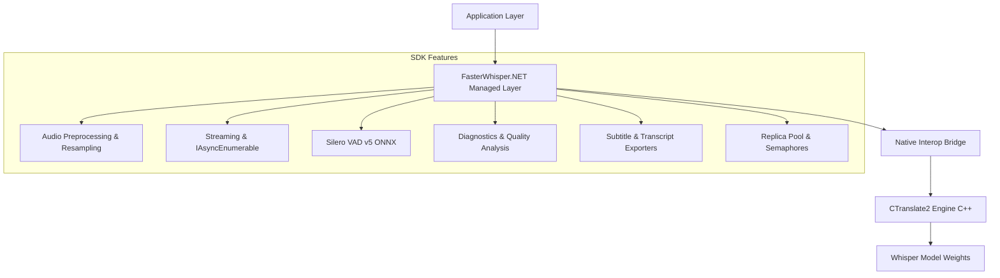

# FasterWhisper.NET

**by [Qourex](https://qourex.com)** — High-Performance Speech Recognition for .NET

[](https://github.com/qourex/fasterwhisper.net/actions/workflows/build.yml)
[](https://www.nuget.org/packages/FasterWhisper.NET)
[](https://www.nuget.org/packages/FasterWhisper.NET)
[](https://qourex.github.io/FasterWhisper.NET/)
[](LICENSE)
[](https://dotnet.microsoft.com)

**[Documentation Portal](https://qourex.github.io/FasterWhisper.NET/)** — Guides, API references, .NET 10.0 samples, and mobile deployment walkthroughs.

---

**FasterWhisper.NET** is a production-ready .NET SDK for OpenAI Whisper built on top of the high-performance **CTranslate2** inference engine.

The library delivers high-throughput offline transcription, real-time streaming, batch inference pipelines, audio quality analytics, hallucination diagnostics, subtitle formatting, and cross-platform native execution for modern .NET workloads.

---

## Why FasterWhisper.NET?

FasterWhisper.NET delivers an optimized, native .NET developer experience for Whisper speech recognition:

- **Idiomatic .NET API Surface** — Clean, type-safe builder patterns and asynchronous APIs (`async/await` and `IAsyncEnumerable<T>`).
- **CTranslate2 Inference Engine** — High-throughput execution with INT8, FP16, and INT16 quantization support.
- **Shared-Weight Replica Pools** — Concurrent multi-threaded inference where replicas share loaded weight tensors in memory to minimize RAM and VRAM overhead.
- **Real-Time Streaming** — Asynchronous push pipelines for live audio capture and incremental segment generation.
- **Integrated Voice Activity Detection (VAD)** — Embedded Silero VAD v5 ONNX model for silence filtering and chunk segmentation.
- **Audio Quality Assessment** — Built-in non-intrusive analyzer evaluating SNR, clipping, and signal clarity prior to inference.
- **Hallucination Diagnostics** — Automated detection and mitigation of repetition loops and silent-region hallucinations.
- **Batched Inference Pipelines** — High-throughput processing for long audio files using concurrent chunk batches.
- **Telemetry and Performance Profiling** — Integrated measurement for Real-Time Factor (RTF), memory consumption, and execution duration.
- **Export Pipelines** — Standardized output formatters for SubRip (SRT), WebVTT, TSV, JSON, and Markdown transcripts.
- **Automated Test Coverage** — Comprehensive suite of 152 automated unit and integration tests validating interop boundaries and reliability.

---

## Ecosystem Positioning

FasterWhisper.NET and Python's `faster-whisper` both leverage CTranslate2 for model inference. FasterWhisper.NET provides a dedicated .NET experience:

- **Type-Safe Native Interop** — Built with source-generated P/Invoke (`[LibraryImport]`) for Native AOT compatibility and zero garbage collection overhead on hot paths.
- **Thread-Safe by Design** — Internal replica coordination and resource semaphores prevent native re-entrancy conflicts in multi-threaded web applications.
- **Enterprise Framework Integration** — First-class patterns for ASP.NET Core Dependency Injection, Blazor Server, Windows Forms, and .NET MAUI.
- **Self-Contained Cross-Platform Packaging** — Pre-compiled native binaries packaged directly into NuGet packages for Windows, Linux, macOS, Android, and iOS.

---

## Project Health

| Metric | Details |
| :--- | :--- |
| **Test Suite** | 152 Automated Tests (Unit, Integration, Concurrency, Interop) |
| **Native Engine** | CTranslate2 v4.7.0 (C++ / CUDA) |
| **License** | MIT License |
| **Target Frameworks** | .NET 8.0, .NET 9.0, .NET 10.0 |
| **Supported Operating Systems** | Windows (x64), Linux (x64), macOS (x64, ARM64), Android (ARM64), iOS (ARM64) |
| **Core Languages** | C#, C++, CUDA |

---

## Feature Matrix

| Capability | Status | Notes |
| :--- | :---: | :--- |
| **Standard Audio Transcription** | Supported | File paths, streams, or raw PCM `float[]` arrays |
| **Real-Time Streaming** | Supported | Asynchronous push pipeline with `IAsyncEnumerable<T>` |
| **Voice Activity Detection (VAD)** | Supported | Embedded Silero VAD v5 ONNX integration |
| **Batched Inference Pipelines** | Supported | Concurrent chunk batching for high-throughput GPU workloads |
| **Shared Replica Pools** | Supported | Weight-shared multi-replica concurrency |
| **Word-Level Timestamps** | Supported | Cross-attention matrix alignment with median filtering |
| **Audio Signal Quality Analysis** | Supported | SNR calculation, clipping detection, quality grading |
| **Hallucination Mitigation** | Supported | Compression ratio validation and temperature fallback sequences |
| **Subtitle and Transcript Export** | Supported | SRT, WebVTT, TSV, JSON, and Markdown formatters |
| **Memory-Mapped Weight Loading** | Supported | Rapid initialization via virtual memory mapping |
| **Native AOT Compatibility** | Supported | Source-generated P/Invoke declarations |

---

## Architecture Overview


```mermaid
graph TD
    App[Application Layer] --> SDK[FasterWhisper.NET Managed Layer]
    subgraph SDK Features
        SDK --> Audio[Audio Preprocessing & Resampling]
        SDK --> Stream[Streaming & IAsyncEnumerable]
        SDK --> VAD[Silero VAD v5 ONNX]
        SDK --> Diag[Diagnostics & Quality Analysis]
        SDK --> Export[Subtitle & Transcript Exporters]
        SDK --> Pool[Replica Pool & Semaphores]
    end
    SDK --> Native[Native Interop Bridge]
    Native --> CT2[CTranslate2 Engine C++]
    CT2 --> Models[Whisper Model Weights]
```

---

## Table of Contents

- [Why FasterWhisper.NET?](#why-fasterwhispernet)
- [Ecosystem Positioning](#ecosystem-positioning)
- [Project Health](#project-health)
- [Feature Matrix](#feature-matrix)
- [Architecture Overview](#architecture-overview)
- [Installation](#installation)
- [Quick Start](#quick-start)
- [Sample Applications](#sample-applications)
- [Available Models](#available-models)
- [Performance Benchmarks](#performance-benchmarks)
- [Advanced Features](#advanced-features)
  - [Fluent Model Builder](#fluent-model-builder)
  - [Concurrency and Multi-Replica Execution](#concurrency-and-multi-replica-execution)
  - [Batched Inference Pipeline](#batched-inference-pipeline)
  - [Word-Level Timestamps](#word-level-timestamps)
  - [Real-Time Streaming Transcription](#real-time-streaming-transcription)
  - [Voice Activity Detection (VAD)](#voice-activity-detection-vad)
  - [In-Memory Model Loading](#in-memory-model-loading)
  - [Language Detection](#language-detection)
  - [Audio Preprocessing Options](#audio-preprocessing-options)
  - [Text Post-Processing Filters](#text-post-processing-filters)
  - [Audio Quality Assessment](#audio-quality-assessment)
  - [Subtitle and Export Formats](#subtitle-and-export-formats)
- [API Reference](#api-reference)
  - [WhisperOptions](#whisperoptions)
  - [VadOptions](#vadoptions)
  - [WhisperSegment](#whispersegment)
  - [WhisperWord](#whisperword)
- [Building from Source](#building-from-source)
- [CUDA Prerequisites](#cuda-prerequisites)
- [Project Structure](#project-structure)
- [Deployment and Production Guidelines](#deployment-and-production-guidelines)
- [Downstream Licensing Obligations](#downstream-licensing-obligations)
- [License](#license)

---

## Installation

Install the package via the .NET CLI:

```bash
dotnet add package FasterWhisper.NET
```

Or via the Package Manager Console:

```powershell
Install-Package FasterWhisper.NET
```

> [!NOTE]
> The base package includes pre-compiled native binaries for **Windows (win-x64)**, **Linux (linux-x64)**, **macOS (osx-x64, osx-arm64)**, **Android (arm64)**, and **iOS (arm64)**. For GPU acceleration on Windows and Linux, install `FasterWhisper.NET.Gpu` and refer to [CUDA Prerequisites](#cuda-prerequisites).

---

## Quick Start

```csharp
using System;
using System.Threading.Tasks;
using Qourex.FasterWhisper.NET;

// 1. Download and initialize the model (cached to ~/.cache/qourex-fasterwhisper)
using var model = await WhisperModel.LoadAsync(
    modelNameOrPath: "base",       // "tiny", "base", "small", "medium", "large-v3", etc.
    device:          "cpu",        // "cpu" or "cuda"
    computeType:     "default"     // "float32", "float16", "int8", "int8_float16", etc.
);

// 2. Configure transcription options
var options = new WhisperOptions
{
    BeamSize = 5,
    WordTimestamps = false
};

// 3. Configure Voice Activity Detection (optional)
var vadOptions = new VadOptions
{
    Enabled   = true,
    Threshold = 0.5f
};

// 4. Transcribe audio (WAV, MP3, MP4, Opus)
var segments = model.Transcribe(
    mediaPath:  "audio.wav",
    language:   "en",           // Pass null for automatic language detection
    options:    options,
    vadOptions: vadOptions
);

// 5. Output results
foreach (var segment in segments)
{
    Console.WriteLine($"[{segment.Start:F2}s -> {segment.End:F2}s] {segment.Text}");
}
```

---

## Sample Applications

A suite of 10 sample applications targeting **.NET 10.0** is provided under the [samples/](samples) directory:

- **Console Application (`Cpu` / `Gpu`)** — Minimal CLI showcasing model downloading progress, parameter configuration, and transcription output.
- **ASP.NET Core Minimal API (`Cpu` / `Gpu`)** — Production-grade REST API (`POST /api/transcribe`) demonstrating thread pool offloading and singleton model registration.
- **Blazor Web App (`Cpu` / `Gpu`)** — Interactive server dashboard with SignalR progress indicators and interactive timeline segment inspection.
- **Windows Forms (`Cpu` / `Gpu`)** — Desktop interface utilizing native **.NET 10.0 Dark Mode** and background worker threads for UI responsiveness.
- **.NET MAUI (`Cpu` / `Gpu`)** — Cross-platform application demonstrating mobile asset extraction and native file picker integration.

For setup details and execution commands, see the [Samples Documentation](samples/README.md).

---

## Available Models

Models are resolved automatically from Hugging Face on first use and cached locally:

| Model | Parameters | Disk Size | Approx. VRAM (FP16) | Relative Speed | Target Use Case |
| :--- | :---: | :---: | :---: | :---: | :--- |
| `tiny` | 39 M | ~75 MB | ~1 GB | Fastest | Mobile devices, unit testing, quick prototyping |
| `base` | 74 M | ~142 MB | ~1 GB | Very Fast | Lightweight applications, desktop utilities |
| `small` | 244 M | ~466 MB | ~2 GB | Fast | General production balance |
| `medium` | 769 M | ~1.5 GB | ~5 GB | Moderate | High-accuracy transcription |
| `large-v1` | 1550 M | ~3.1 GB | ~10 GB | Standard | Legacy large model checkpoint |
| `large-v2` | 1550 M | ~3.1 GB | ~10 GB | Standard | Improved large model checkpoint |
| `large-v3` | 1550 M | ~3.1 GB | ~10 GB | Standard | Highest overall accuracy and multilingual quality |
| `large-v3-turbo` | 809 M | ~1.6 GB | ~3 GB | Fast | High accuracy with reduced decoder depth |
| `faster-distil-whisper-large-v3` | 756 M | ~1.5 GB | ~3 GB | Fast | Optimized English-only speed and accuracy |

### Devices and Compute Types

| Device | Description |
| :--- | :--- |
| `"cpu"` | CPU execution with Intel oneMKL / OpenBLAS acceleration |
| `"cuda"` | NVIDIA GPU execution via CUDA and cuDNN runtimes |

| Compute Type | Description |
| :--- | :--- |
| `"default"` | Automatically selects the optimal precision for the host hardware |
| `"float32"` | Full 32-bit floating point precision |
| `"float16"` | 16-bit half precision (recommended for CUDA devices) |
| `"int8"` | 8-bit integer quantization (fastest, lowest memory footprint) |
| `"int8_float16"` | INT8 quantized compute with FP16 activation storage |
| `"int16"` | 16-bit integer quantization |

---

## Performance Benchmarks

The following benchmarks demonstrate throughput and memory characteristics across CPU and GPU configurations.

### Benchmark Hardware Environment

- **CPU**: Intel Core i7-4790 (4 Cores / 8 Threads)
- **RAM**: 32 GB DDR3
- **GPU**: NVIDIA GeForce GTX 1070 Ti (8 GB VRAM)
- **CUDA**: 12.4 / cuDNN 9.1
- **Operating System**: Windows 11 Pro
- **Model**: `faster-distil-whisper-large-v3` (756 million parameters)
- **Audio Duration**: 972.29 seconds (16.2 minutes)

### Initialization and Memory Overhead: Standard vs. Memory-Mapped

| Loading Strategy | Load Time | CPU RAM Delta | GPU VRAM Delta | Startup Speedup |
| :--- | :---: | :---: | :---: | :---: |
| **Standard Path-Based Load** | 3,172.8 ms | 110.1 MB | 3,814.0 MB | Baseline |
| **Memory-Mapped Load** | 2,506.2 ms | 963.1 MB | 3,713.0 MB | **1.27x** |

> [!NOTE]
> Standard loading delegates allocations to the native C++ heap. Memory-mapped loading allocates virtual memory buffers within C# before passing pinned pointers to CTranslate2, reflecting in managed process working set telemetry.

### Multi-Replica Resource Scaling (Shared Model Weights)

When scaling concurrent execution threads via `NumReplicas`, CTranslate2 shares model weights across replicas:

| Configuration | Load Time | CPU RAM | GPU VRAM |
| :--- | :---: | :---: | :---: |
| **NumReplicas = 1** | 2,516.7 ms | 963.1 MB | 3,712.0 MB |
| **NumReplicas = 2** | 2,406.2 ms | 1,454.2 MB | 3,700.0 MB |
| **NumReplicas = 4** | 2,496.4 ms | 1,447.3 MB | 3,712.0 MB |

### Throughput and Optimization Results

| Phase / Configuration | Duration | Throughput Metric |
| :--- | :---: | :---: |
| **Quantization `'default'` (float32)** | 44,403.2 ms | Real-Time Factor (RTF): `0.0457` |
| **Quantization `'int8'`** | 31,708.0 ms | Real-Time Factor (RTF): `0.0326` |
| **Quantization Improvement (int8 vs. float32)** | — | **1.40x Speedup** |
| **4 Sequential Requests (Replica = 1)** | 179,217.2 ms | Baseline |
| **4 Concurrent Requests (Replica = 2)** | 155,992.5 ms | **1.15x Speedup** |
| **Sequential File Transcription (2x Audio)** | 89,092.7 ms | Baseline |
| **Batched Pipeline Transcription (2x Audio)** | 57,802.7 ms | **1.54x Speedup** |

---

## Advanced Features

### Fluent Model Builder

```csharp
using Qourex.FasterWhisper.NET;

using var model = await WhisperModelBuilder.Create("base")
    .WithDevice("cuda")
    .WithComputeType("float16")
    .WithNumReplicas(2)
    .WithVad(threshold: 0.5f)
    .WithWordTimestamps()
    .WithDenoising()
    .BuildAsync();

var segments = model.Transcribe("meeting.wav");
```

### Concurrency and Multi-Replica Execution

```csharp
// Load model with 2 replicas sharing weights in memory
using var model = await WhisperModel.LoadAsync(
    modelNameOrPath: "base",
    device: "cpu",
    numReplicas: 2
);

// Transcribe multiple files concurrently
var tasks = new[] { "audio1.wav", "audio2.wav" }.Select(file => Task.Run(() =>
{
    var segments = model.Transcribe(file);
    Console.WriteLine($"Finished transcribing: {file}");
}));

await Task.WhenAll(tasks);
```

### Batched Inference Pipeline

```csharp
using Qourex.FasterWhisper.NET;

using var model = await WhisperModel.LoadAsync("base", device: "cuda");
using var pipeline = new BatchedInferencePipeline(model, batchSize: 8);

var result = pipeline.Transcribe("podcast.mp3");
foreach (var segment in result.Segments)
{
    Console.WriteLine($"[{segment.Start:F2}s -> {segment.End:F2}s] {segment.Text}");
}
```

### Word-Level Timestamps

```csharp
var options = new WhisperOptions
{
    WordTimestamps    = true,
    MedianFilterWidth = 7 // Smoothing kernel width for cross-attention matrix
};

var segments = model.Transcribe("interview.wav", language: "en", options: options);

foreach (var segment in segments)
{
    Console.WriteLine($"[{segment.Start:F2}s -> {segment.End:F2}s] {segment.Text}");

    foreach (var word in segment.Words)
    {
        Console.WriteLine($"  '{word.Word}' [{word.Start:F2}s -> {word.End:F2}s] (p={word.Probability:F3})");
    }
}
```

### Real-Time Streaming Transcription

```csharp
async IAsyncEnumerable<float[]> GetAudioStream()
{
    // Capture 16 kHz mono float32 PCM buffers
    while (isCapturing)
    {
        yield return await microphone.ReadChunkAsync();
    }
}

var options = new WhisperOptions { BeamSize = 1 }; // Greedy decoding for lowest latency
var vadOptions = new VadOptions
{
    Enabled              = true,
    Threshold            = 0.5f,
    MinSpeechDurationMs  = 250,
    MinSilenceDurationMs = 100
};

await foreach (var segment in model.TranscribeStreamAsync(
    GetAudioStream(),
    language: "en",
    options: options,
    vadOptions: vadOptions))
{
    Console.WriteLine($"[Live] {segment.Text}");
}
```

### Voice Activity Detection (VAD)

```csharp
var vadOptions = new VadOptions
{
    Enabled              = true,   // Enable Silero VAD segmentation
    Threshold            = 0.5f,   // Speech probability threshold (0.0 to 1.0)
    MinSpeechDurationMs  = 250,    // Minimum duration of speech intervals (ms)
    MinSilenceDurationMs = 1000    // Minimum silence required to split chunks (ms)
};

var segments = model.Transcribe("meeting.mp3", language: null, vadOptions: vadOptions);
```

### In-Memory Model Loading

> [!WARNING]
> The dictionary must include either `vocabulary.txt` or `vocabulary.json` alongside `model.bin` and `config.json`. Omitting vocabulary data results in a `KeyNotFoundException` during tokenizer initialization.

```csharp
var modelFiles = new Dictionary<string, byte[]>
{
    ["model.bin"]       = File.ReadAllBytes("path/to/model.bin"),
    ["config.json"]     = File.ReadAllBytes("path/to/config.json"),
    ["vocabulary.txt"]  = File.ReadAllBytes("path/to/vocabulary.txt")
};

using var model = new WhisperModel(
    modelFiles,
    device: "cpu",
    computeType: "int8",
    cpuThreads: 4
);

var segments = model.Transcribe("audio.wav", language: "en");
```

### Language Detection

```csharp
float[] pcm = audioProcessor.LoadWav("speech.wav");
var detectedLanguages = model.DetectLanguage(pcm);

foreach (var (language, probability) in detectedLanguages.Take(5))
{
    Console.WriteLine($"  {language}: {probability:P1}");
}
```

### Audio Preprocessing Options

```csharp
var options = new WhisperOptions
{
    NormalizeAudio    = true,   // RMS amplitude normalization (target -20 dBFS)
    CutLowFrequencies = true,   // 80 Hz high-pass filter (removes DC offset and hum)
    PreEmphasis       = false,  // High-frequency emphasis filter
    DenoiseAudio      = false   // Spectral subtraction noise gate
};
```

### Text Post-Processing Filters

```csharp
var options = new WhisperOptions
{
    FilterFillerWords       = true,   // Removes vocal hesitations ("uh", "um", "ah", "eh", "mhm")
    PruneStutters           = true,   // Removes consecutive duplicate words
    ConditionOnPreviousText = true    // Retains preceding context for window continuity
};
```

### Audio Quality Assessment

```csharp
float[] samples = WhisperModel.LoadAudio("input.wav");
var report = AudioQualityReport.Assess(samples);

Console.WriteLine($"Quality Grade: {report.OverallGrade}");
Console.WriteLine($"Signal-to-Noise Ratio: {report.SignalToNoiseRatio:F1} dB");

foreach (var suggestion in report.Suggestions)
{
    Console.WriteLine($"Recommendation: {suggestion}");
}
```

### Subtitle and Export Formats

```csharp
var segments = model.Transcribe("presentation.wav");

// 1. Export as SRT string
string srtContent = SubtitleExporter.ToSrt(segments);
File.WriteAllText("presentation.srt", srtContent);

// 2. Export directly to WebVTT file
SubtitleExporter.WriteVtt(segments, "presentation.vtt");

// 3. Export as TSV or JSON data
string tsvContent = SubtitleExporter.ToTsv(segments);
string jsonContent = SubtitleExporter.ToJson(segments);
```

---

## API Reference

### WhisperOptions

| Property | Type | Default | Description |
| :--- | :--- | :--- | :--- |
| `BeamSize` | `int` | `5` | Beam size for beam search decoding. Set to `1` for greedy decoding |
| `Patience` | `float` | `1.0` | Beam search patience factor |
| `LengthPenalty` | `float` | `1.0` | Exponential penalty applied to sequence length |
| `RepetitionPenalty` | `float` | `1.0` | Penalty applied to previously generated tokens |
| `NoRepeatNgramSize` | `int` | `0` | Prevent repetition of n-grams of this size (`0` disables) |
| `MaxLength` | `int` | `448` | Maximum tokens generated per 30-second window |
| `SamplingTopK` | `int` | `1` | Top-K sampling pool size (`1` = deterministic greedy) |
| `SamplingTemperature` | `float` | `1.0` | Softmax temperature for non-greedy sampling |
| `NumHypotheses` | `int` | `1` | Number of hypothesis candidates returned |
| `ReturnScores` | `bool` | `true` | Include token log-probability scores in output |
| `ReturnNoSpeechProb` | `bool` | `true` | Include silence probability scores in output |
| `MaxInitialTimestampIndex` | `int` | `50` | Maximum index of the initial predicted timestamp token |
| `SuppressBlank` | `bool` | `true` | Suppress blank outputs at start of sampling |
| `SuppressTokens` | `int[]?` | `[-1]` | Explicit token IDs to suppress during decoding |
| `WordTimestamps` | `bool` | `false` | Extract per-word timestamp boundaries via cross-attention |
| `MedianFilterWidth` | `int` | `7` | Smoothing kernel width for cross-attention matrix |
| `Temperatures` | `float[]` | `[0.0, 0.2, 0.4, 0.6, 0.8, 1.0]` | Temperature sequence used for validation fallbacks |
| `LogProbThreshold` | `float` | `-1.0` | Minimum average log-probability threshold |
| `NoSpeechThreshold` | `float` | `0.6` | Maximum no-speech confidence before classifying as silence |
| `CompressionRatioThreshold` | `float` | `2.4` | Maximum gzip compression ratio before flagging repetitive loops |
| `Prefix` | `string?` | `null` | Text prefix used to constrain initial chunk generation |
| `WithoutTimestamps` | `bool` | `false` | Suppress timestamp token generation |
| `NormalizeAudio` | `bool` | `true` | Standardize signal levels via RMS normalization |
| `CutLowFrequencies` | `bool` | `true` | Apply 80 Hz high-pass filter |
| `ConditionOnPreviousText` | `bool` | `true` | Pass preceding transcript into subsequent window prompt |
| `FilterFillerWords` | `bool` | `false` | Remove vocal filler words from output text |
| `PruneStutters` | `bool` | `false` | Remove consecutive duplicate words |
| `PreEmphasis` | `bool` | `false` | Apply high-frequency pre-emphasis filter |
| `DenoiseAudio` | `bool` | `false` | Apply spectral subtraction noise gate |
| `InitialPrompt` | `string?` | `null` | Contextual text prompt guiding vocabulary and style |
| `Hotwords` | `string?` | `null` | Comma-separated list of prioritized domain words |
| `HallucinationSilenceThreshold` | `float` | `0` | Skip generation across silent regions exceeding duration (s) |
| `PrependPunctuations` | `string` | `"\"'“¿([{-"` | Punctuation prepended to following word |
| `AppendPunctuations` | `string` | `"\".。,，!！?？:：)”)]}、"` | Punctuation appended to preceding word |
| `MaxNewTokens` | `int` | `0` | Maximum new tokens generated per chunk (`0` = use `MaxLength`) |
| `BestOf` | `int` | `5` | Number of candidate sequences evaluated when temperature > 0 |
| `PromptResetOnTemperature` | `float` | `0.5` | Discard previous context when fallback temperature reaches threshold |
| `ClipTimestamps` | `List<(float, float)>?` | `null` | Temporal boundaries restricting transcription |
| `Multilingual` | `bool` | `false` | Perform language detection per 30-second window |
| `AdaptiveBeamSize` | `bool` | `true` | Use greedy decoding at temp=0 and expand during fallback |
| `RestoreTextFormatting` | `bool` | `false` | Apply grammar-based capitalization and punctuation rules |
| `VocabularyBias` | `Dictionary<string, float>?` | `null` | Direct logit probability biases for specific token strings |
| `MultiPassEnabled` | `bool` | `false` | Enable second-pass decoding for low-confidence segments |
| `MultiPassConfidenceThreshold` | `float` | `0.6` | Confidence threshold triggering second-pass decoding |
| `MultiPassBeamSize` | `int` | `10` | Beam size used during second-pass decoding |

### VadOptions

| Property | Type | Default | Description |
| :--- | :--- | :--- | :--- |
| `Enabled` | `bool` | `false` | Enable or disable Silero VAD segmentation |
| `Threshold` | `float` | `0.5` | Speech probability threshold (0.0 to 1.0) |
| `MinSpeechDurationMs` | `int` | `250` | Minimum speech duration in milliseconds |
| `MinSilenceDurationMs` | `int` | `2000` | Minimum silence duration in milliseconds to trigger chunk split |

### WhisperSegment

| Property | Type | Description |
| :--- | :--- | :--- |
| `Text` | `string` | Transcribed text content |
| `Tokens` | `int[]` | Raw token IDs generated by the model tokenizer |
| `Score` | `float` | Average log-probability score |
| `NoSpeechProb` | `float` | Probability that the segment contains non-speech |
| `Start` | `float` | Start timestamp in seconds |
| `End` | `float` | End timestamp in seconds |
| `Words` | `List<WhisperWord>` | Word-level alignments (populated when `WordTimestamps = true`) |

### WhisperWord

| Property | Type | Description |
| :--- | :--- | :--- |
| `Word` | `string` | Word text content |
| `Start` | `float` | Start timestamp in seconds |
| `End` | `float` | End timestamp in seconds |
| `Probability` | `float` | Alignment confidence score (0.0 to 1.0) |

---

## Building from Source

### Prerequisites

| Component | Target Requirement | Download Link |
| :--- | :--- | :--- |
| **CMake 3.18+** | Native C++ build system | [cmake.org](https://cmake.org/download/) |
| **Visual Studio 2022** (MSVC) | C++ compiler | [visualstudio.com](https://visualstudio.com) |
| **CUDA Toolkit 12.x** | GPU builds only | [NVIDIA Developer](https://developer.nvidia.com/cuda-downloads) |
| **cuDNN 9.x** | GPU builds only | [NVIDIA Developer](https://developer.nvidia.com/cudnn) |
| **.NET SDK 8.0+** | Managed library build | [dotnet.microsoft.com](https://dotnet.microsoft.com) |

### Automated Build Script

The repository includes a PowerShell automation script (`build.ps1`):

```powershell
# Build with CUDA GPU acceleration (default)
.\build.ps1

# Build CPU-only (no CUDA or NVCC required)
.\build.ps1 -CpuOnly
```

The script automatically executes the following steps:
1. Configures and compiles the native C++ wrapper (`qourex_fasterwhisper_native.dll`).
2. Copies native dynamic libraries into `runtimes/win-x64/native/`.
3. Builds the .NET solution and packs NuGet packages into `./artifacts/`.

---

## CUDA Prerequisites

> [!IMPORTANT]
> CUDA and cuDNN runtimes are required only when initializing models with `device: "cuda"`. CPU execution has no external GPU dependencies.

1. **NVIDIA CUDA Toolkit 12.x** — [Download](https://developer.nvidia.com/cuda-downloads)
2. **NVIDIA cuDNN 9.x** — [Download](https://developer.nvidia.com/cudnn)

Ensure the following dynamic libraries are present in your system `PATH`:
- `cudart64_*.dll`
- `cublas64_*.dll`
- `cublasLt64_*.dll`
- `cudnn64_*.dll`

### Flash Attention Support

Flash Attention accelerates inference on supported NVIDIA GPUs (Ampere architecture or newer, compute capability ≥ 8.0):

```csharp
using var model = await WhisperModel.LoadAsync(
    modelNameOrPath: "large-v3",
    device:          "cuda",
    computeType:     "float16",
    flashAttention:  true
);
```

---

## Project Structure

```
Qourex.FasterWhisper/
├── src/
│   ├── Qourex.FasterWhisper.Native/   # C++ CMake wrapper for CTranslate2
│   │   ├── CMakeLists.txt
│   │   ├── qourex_fasterwhisper_native.cpp
│   │   └── qourex_fasterwhisper_native.h
│   ├── Qourex.FasterWhisper.NET/      # Core managed library (CPU Package)
│   │   ├── AudioProcessor.cs          # WAV decoding, resampling, Mel extraction
│   │   ├── AudioQualityReport.cs      # Signal quality assessment
│   │   ├── BatchedInferencePipeline.cs# High-throughput batch inference pipeline
│   │   ├── HallucinationDetector.cs   # Repetition and hallucination detection
│   │   ├── ModelDownloader.cs         # Hugging Face model downloader
│   │   ├── NativeMethods.cs           # P/Invoke declarations
│   │   ├── SileroVad.cs               # Silero VAD v5 ONNX integration
│   │   ├── StreamingMelExtractor.cs   # Real-time streaming Mel extractor
│   │   ├── SubtitleExporter.cs        # SRT, VTT, TSV, JSON export pipeline
│   │   ├── WhisperModel.cs            # Primary model API
│   │   └── WhisperModelBuilder.cs     # Fluent builder API
│   └── Qourex.FasterWhisper.NET.Gpu/  # GPU package source and assets
├── samples/
│   ├── Qourex.FasterWhisper.NET.Samples.Console.Cpu/
│   ├── Qourex.FasterWhisper.NET.Samples.Console.Gpu/
│   ├── Qourex.FasterWhisper.NET.Samples.AspNetCore.Cpu/
│   ├── Qourex.FasterWhisper.NET.Samples.AspNetCore.Gpu/
│   ├── Qourex.FasterWhisper.NET.Samples.Blazor.Cpu/
│   ├── Qourex.FasterWhisper.NET.Samples.Blazor.Gpu/
│   ├── Qourex.FasterWhisper.NET.Samples.WinForms.Cpu/
│   ├── Qourex.FasterWhisper.NET.Samples.WinForms.Gpu/
│   ├── Qourex.FasterWhisper.NET.Samples.Maui.Cpu/
│   ├── Qourex.FasterWhisper.NET.Samples.Maui.Gpu/
│   └── README.md
├── tests/
│   └── Qourex.FasterWhisper.NET.Tests/ # xUnit test suite (152 tests)
├── docs/                              # VitePress documentation portal
├── build.ps1                          # PowerShell build script
├── build.sh                           # Bash build script
├── Qourex.FasterWhisper.slnx          # Solution file
└── LICENSE                            # MIT License
```

---

## Deployment and Production Guidelines

### ASP.NET Core Integration

`WhisperModel` allocates native weights and initializes CTranslate2 execution engines. Model instances should be registered as a **Singleton** in your ASP.NET Core dependency injection container:

```csharp
// Program.cs
builder.Services.AddSingleton<WhisperModel>(sp =>
{
    return WhisperModel.LoadAsync(
        modelNameOrPath: "base",
        device:          "cpu",
        computeType:     "default",
        numReplicas:     2 // Enable 2 concurrent worker replicas
    ).GetAwaiter().GetResult();
});
```

Because `WhisperModel` coordinates concurrent calls internally via replica pools and semaphores, it can be safely injected into scoped controllers or minimal APIs:

```csharp
[ApiController]
[Route("api/transcribe")]
public class TranscriptionController : ControllerBase
{
    private readonly WhisperModel _model;

    public TranscriptionController(WhisperModel model)
    {
        _model = model;
    }

    [HttpPost]
    public async Task<IActionResult> TranscribeAudio(IFormFile file)
    {
        using var stream = file.OpenReadStream();
        var segments = await Task.Run(() => _model.Transcribe(stream));
        return Ok(segments);
    }
}
```

### Docker GPU Deployment (Linux Container)

```dockerfile
FROM nvidia/cuda:12.4.1-runtime-ubuntu22.04

RUN apt-get update && apt-get install -y \
    dotnet-sdk-8.0 \
    libcublas-12-4 \
    libcudnn9-cuda-12 \
    && rm -rf /var/lib/apt/lists/*

WORKDIR /app
COPY . .
RUN dotnet publish -c Release -o out

ENTRYPOINT ["dotnet", "out/YourApplication.dll"]
```

Execute with NVIDIA GPU access:
```bash
docker run --gpus all -it your-whisper-app
```

### Troubleshooting and Diagnostics

#### Issue: `DllNotFoundException` (Native Library Missing)
- **Cause**: On Windows, the native wrapper depends on the Visual C++ Redistributable and Intel MKL runtime libraries. On GPU builds, CUDA 12.x and cuDNN runtime DLLs must be located in the system `PATH`.
- **Resolution**:
  1. Install the [Visual C++ Redistributable](https://aka.ms/vs/17/release/vc_redist.x64.exe).
  2. For GPU execution, verify that `cudart64_12.dll`, `cublas64_12.dll`, and `cudnn64_9.dll` reside in your `PATH`. Verify environment setup by testing `device: "cpu"` first.

#### Issue: `StackOverflowException` in `StreamingMelExtractor`
- **Cause**: Supplying an excessively large FFT window size exceeds stack allocation thresholds.
- **Resolution**: Maintain `fftSize` below `8192` (default is `400` or `512`).

---

## Downstream Licensing Obligations

When deploying applications utilizing FasterWhisper.NET, downstream developers must comply with the licenses of bundled and external dependencies:

1. **Intel oneMKL (ISSL License)**:
   Windows packages bundle Intel MKL runtime binaries under the Intel Simplified Software License (ISSL). Downstream commercial users should note that the ISSL contains reverse-engineering restrictions. For environments where ISSL terms cannot be met, run on Linux (which links dynamically to OpenBLAS) or compile the native wrapper with alternative BLAS engines.
2. **FFmpeg (LGPL / GPL)**:
   The library invokes the external `ffmpeg` CLI as a fallback subprocess for non-WAV media. Ensure compliance with FFmpeg redistribution terms if bundling FFmpeg binaries with your application. WAV files are decoded using a 100% managed C# decoder and do not require FFmpeg.
3. **ONNX Runtime and Silero VAD (MIT License)**:
   Both dependencies are distributed under the MIT license. Downloaded Silero VAD model assets are verified via SHA-256 integrity checks.

---

## License

This project is licensed under the **MIT License** — see the [LICENSE](LICENSE) file for details.

```
MIT License · Copyright (c) 2026 Qourex
```

---

<p align="center">
  Maintained by Qourex
  <br />
  <a href="https://github.com/qourex/fasterwhisper.net/issues">Report Issue</a> · <a href="https://github.com/qourex/fasterwhisper.net/discussions">Discussions</a>
</p>
