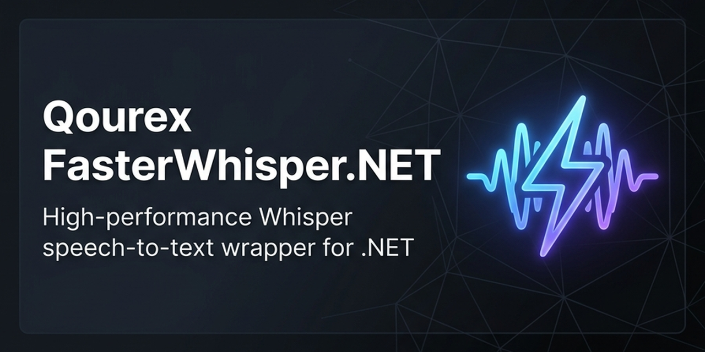

<p align="center">
  
</p>

# FasterWhisper.NET.Gpu

<p align="center">
  <strong>by <a href="https://qourex.com">Qourex</a></strong> — Bringing high-performance GPU-accelerated speech recognition to .NET
</p>

<p align="center">
  <a href="https://github.com/qourex/fasterwhisper.net/actions/workflows/build.yml"></a>
  <a href="https://www.nuget.org/packages/FasterWhisper.NET.Gpu"></a>
  <a href="https://www.nuget.org/packages/FasterWhisper.NET.Gpu"></a>
  <a href="LICENSE"></a>
  <a href="https://dotnet.microsoft.com"></a>
</p>

---

**FasterWhisper.NET.Gpu** is the GPU-accelerated release of the C# port of the popular Python library [faster-whisper](https://github.com/SYSTRAN/faster-whisper). It bundles pre-compiled native binaries built with **CUDA** and **cuDNN** enabled for CTranslate2, delivering blazing-fast transcription times on NVIDIA GPUs.

For CPU-only execution without CUDA prerequisites, please use the base [FasterWhisper.NET](https://www.nuget.org/packages/FasterWhisper.NET) package.

---

## ⚡ Key GPU Advantages

- **🎮 CUDA & cuDNN Acceleration** — Native GPU-bound inference for Whisper models.
- **🚀 Flash Attention Support** — Substantial throughput improvements on Ampere (RTX 30-series) and newer architectures.
- **📉 Mixed Precision Compute** — Full support for `"float16"` and `"int8_float16"` compute types to minimize GPU memory (VRAM) footprint.
- **🔄 Parallel Mel Extraction** — Managed multi-threaded audio pipeline maximizing core usage before GPU scheduling.

---

## 📦 Installation

To install the GPU-enabled package:

```bash
dotnet add package FasterWhisper.NET.Gpu
```

## 🚀 CUDA Prerequisites

To run this package with GPU acceleration (`device: "cuda"`), you must have the following NVIDIA runtimes installed and configured on your host system:

### Windows
1. **NVIDIA CUDA Toolkit 12.x** — [CUDA Downloads](https://developer.nvidia.com/cuda-downloads)
2. **NVIDIA cuDNN 9.x** — [cuDNN Downloads](https://developer.nvidia.com/cudnn)

Ensure that the following DLLs from these installations are available in your system `PATH`:
- `cudart64_12.dll` (or other CUDA 12 runtime versions)
- `cublas64_12.dll`
- `cublasLt64_12.dll`
- `cudnn64_9.dll`

### Linux / WSL2
1. **NVIDIA CUDA Toolkit 12.x** — [WSL/Linux CUDA Downloads](https://developer.nvidia.com/cuda-downloads)
2. **NVIDIA cuDNN 9.x** — [cuDNN Downloads](https://developer.nvidia.com/cudnn)

Ensure that the following shared libraries from these installations are available in your `LD_LIBRARY_PATH` or system library paths (e.g. `/usr/local/cuda/lib64`):
- `libcudart.so.12`
- `libcublas.so.12`
- `libcublasLt.so.12`
- `libcudnn.so.9`

---

## 🐳 Docker Compilation (For Linux GPU Binaries)

For Linux and WSL2 environments, you can compile the CUDA native libraries natively without installing compilers on your host system by using a Docker container.

Run the following command from the root of the repository:
```bash
docker run --rm --gpus all -v "$(pwd)":/workspace -w /workspace nvidia/cuda:12.4.1-cudnn-devel-ubuntu22.04 bash -c "
  apt-get update && \
  apt-get install -y cmake build-essential git && \
  ./build.sh --gpu-only
"
```
*Note: If your local Docker setup does not have the NVIDIA Container Toolkit configured, you can omit the `--gpus all` flag, as a physical GPU is not required during the compilation step.*

This command compiles the wrapper and automatically stages the output `libqourex_fasterwhisper_native.so` and `libctranslate2.so` files under the C# GPU project runtimes directory (`src/Qourex.FasterWhisper.NET.Gpu/runtimes/linux-x64/native/`).

---

## 💻 Quick Start

> [!NOTE]
> **Concurrency & Thread-Safety:** `WhisperModel` is thread-safe and supports concurrent transcription calls. Under the hood, concurrent calls are queued and processed safely using a `SemaphoreSlim`. If you configure the model with `NumReplicas > 1`, transcription calls will execute concurrently utilizing CTranslate2's native thread-safe replica pool, sharing the same loaded model weights in memory to minimize VRAM overhead.

```csharp
using Qourex.FasterWhisper.NET;

// 1. Download and load the model on CUDA (cached to ~/.cache/qourex-fasterwhisper)
using var model = await WhisperModel.LoadAsync(
    modelNameOrPath: "large-v3",
    device:          "cuda",       // Use GPU
    computeType:     "float16",    // Half-precision for optimal GPU performance
    flashAttention:  true          // Enable Flash Attention (requires compute capability >= 8.0)
);

// 2. Configure transcription options
var options = new WhisperOptions
{
    BeamSize = 5,
    WordTimestamps = true
};

// 3. Transcribe
var segments = model.Transcribe(
    mediaPath:  "audio.wav",
    language:   "en",
    options:    options
);

// 4. Print timing and text
foreach (var segment in segments)
{
    Console.WriteLine($"[{segment.Start:F2}s -> {segment.End:F2}s] {segment.Text}");
}
```

---

## 🔧 GPU Configuration Options

### Compute Types

Choose the optimal precision for your GPU memory and compute capabilities:

| Compute Type | Description |
|:-------------|:------------|
| `"default"` | Selects `float16` if supported by the GPU, else fallback |
| `"float16"` | Recommended. Fast FP16 execution, lowest VRAM utilization |
| `"float32"` | Standard 32-bit floating point precision |
| `"int8_float16"` | INT8 quantized calculations with FP16 storage |

### Flash Attention

Enable Flash Attention for compatible GPUs:
```csharp
flashAttention: true
```
*Note: Flash Attention requires an NVIDIA GPU with compute capability ≥ 8.0 (Ampere architecture or newer, e.g. RTX 30-series, 40-series, A100, H100).*

---

## 📄 License

This package is licensed under the **MIT License** — see the [LICENSE](LICENSE) file for details.

```
MIT License · Copyright (c) 2026 Qourex
```
