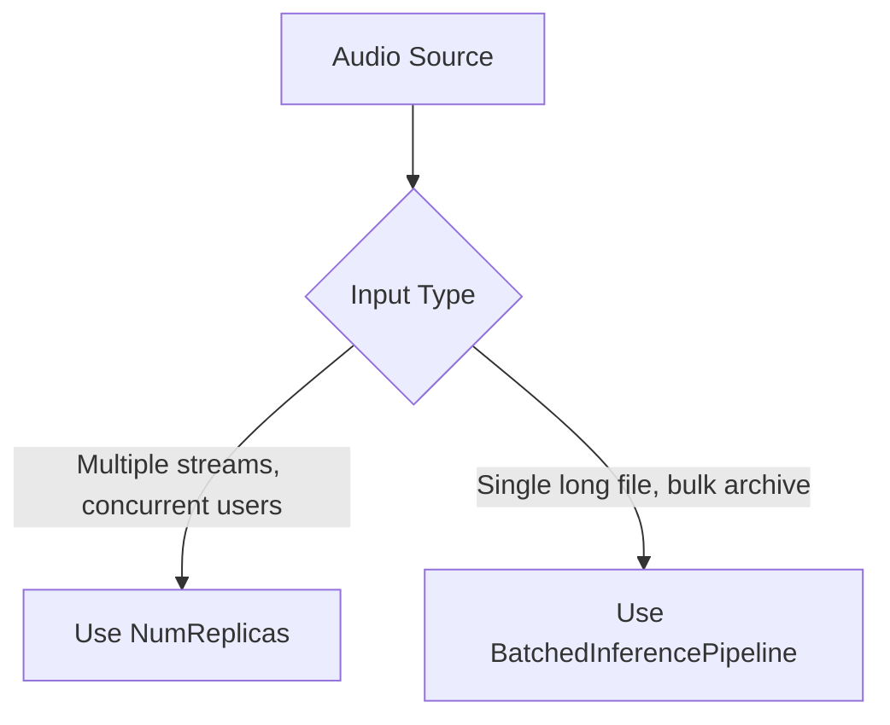

# API Reference

This page contains the exhaustive configuration options, parameter explanations, and output object models for **FasterWhisper.NET**.

---

## ⚙️ WhisperOptions

The `WhisperOptions` class controls the behavior of the Whisper transcription model, including beam search parameters, temperature fallbacks, audio preprocessing, text post-filtering, and multipass alignment.

Every property is initialized with a sensible default for general transcription.

### Generation & Decoding Parameters

| Option | Type | Default | Detailed Explanation & Recommendations |
| :--- | :--- | :--- | :--- |
| **`BeamSize`** | `int` | `5` | **Beam Search Width**: Number of active candidate sentences tracked at each step. Increasing this (e.g., to `10`) can improve transcription accuracy at the expense of CPU/GPU runtime. Set to `1` to run fast **greedy decoding** (recommended for streaming or low-resource mobile environments). |
| **`Patience`** | `float` | `1.0` | **Beam Search Patience**: Scaling factor for beam search. A patience of `1.0` uses default stopping criteria. Higher values (e.g., `1.5` or `2.0`) force the model to explore longer paths, which can prevent premature termination of sentences. |
| **`LengthPenalty`** | `float` | `1.0` | **Length Bias**: Exponential penalty applied to sentence length. Value `< 1.0` favors shorter segments, while values `> 1.0` favor longer sentences. Adjust this if the model is producing incomplete/truncated transcripts or repeating words to meet length criteria. |
| **`RepetitionPenalty`** | `float` | `1.0` | **Repetition Penalty**: Discourages the generator from repeating previously output tokens. A value of `1.0` is neutral. Set to `1.1`–`1.3` if the model enters repetitive loops (hallucinating similar phrases). |
| **`NoRepeatNgramSize`** | `int` | `0` | **N-Gram Repetition Block**: Prevents the generator from repeating n-grams of this token length. For example, if set to `3`, the model cannot output the same three-word sequence twice in the same segment. `0` disables this block. |
| **`MaxLength`** | `int` | `448` | **Max Segment Tokens**: The upper limit of tokens (sub-words/punctuation) that can be generated for a single 30-second audio window. |
| **`MaxNewTokens`** | `int` | `0` | **Max Tokens Per Chunk**: Limits the number of newly generated tokens for the current chunk. A value of `0` delegates limits entirely to `MaxLength`. |
| **`SamplingTopK`** | `int` | `1` | **Top-K Sampling**: Restricts the token selection to the top K most likely options at each step. Set to `1` for deterministic greedy/beam search. Set to `0` to sample from the entire probability distribution (which requires `SamplingTemperature > 0.0`). |
| **`SamplingTemperature`** | `float` | `1.0` | **Softmax Temperature**: Controls the randomness of token generation when sampling. Values near `0.0` make the output highly deterministic. Higher values (up to `1.0`) introduce diversity, which is useful when the default greedy path fails. |
| **`BestOf`** | `int` | `5` | **Candidate Sample Count**: The number of parallel candidate transcripts generated and graded when `SamplingTemperature > 0.0`. The model picks the one with the highest log-probability. |
| **`NumHypotheses`** | `int` | `1` | **Hypothesis Count**: Number of transcription candidates to return in the segment output. Usually kept at `1` for production. |
| **`ReturnScores`** | `bool` | `true` | **Output Generation Score**: If enabled, includes log-likelihood probability scores in the returned segment data. |
| **`ReturnNoSpeechProb`** | `bool` | `true` | **No-Speech Probability**: Includes the model's confidence that the transcribed segment contains background noise or silence instead of speech. |
| **`WithoutTimestamps`** | `bool` | `false` | **Disable Timestamps**: Suppresses the generation of timestamp tokens. Useful if you only need the raw text and want to maximize decoding speed. |

### Temperature Fallback Sequence

| Option | Type | Default | Detailed Explanation & Recommendations |
| :--- | :--- | :--- | :--- |
| **`Temperatures`** | `float[]` | `[0.0, 0.2, 0.4, 0.6, 0.8, 1.0]` | **Fallback Sequence**: When Whisper processes a segment, it validates the output using thresholds like compression ratio and log-probability. If a segment fails, it retries transcription using the next temperature in this array. Retrying with a higher temperature introduces randomness to break repetitive loops. |
| **`PromptResetOnTemperature`** | `float` | `0.5` | **Context Flush Threshold**: If the temperature fallback sequence reaches this threshold, previous context prompts are discarded, forcing the model to re-evaluate the current audio segment without potentially corrupting history. |

### Diagnostic & Validation Thresholds

| Option | Type | Default | Detailed Explanation & Recommendations |
| :--- | :--- | :--- | :--- |
| **`LogProbThreshold`** | `float` | `-1.0` | **Min Log Probability**: If the average log-probability of the generated segment is below this value, the transcription is considered unreliable. Whisper will discard the result and trigger a fallback retry. |
| **`NoSpeechThreshold`** | `float` | `0.6` | **Max Silence Probability**: If the model predicts a silence/noise probability higher than this threshold, AND the average log-probability is below `LogProbThreshold`, the segment is discarded as silence. |
| **`CompressionRatioThreshold`** | `float` | `2.4` | **Max Repeat Compression**: The transcript is compressed using gzip. If the compression ratio is higher than `2.4`, it indicates highly repetitive text (a common failure mode in Whisper). The segment is discarded and retried with a higher temperature. |
| **`HallucinationSilenceThreshold`** | `float` | `0` | **Hallucination Skip Duration**: If the audio analyzer detects a silence longer than this threshold (in seconds), it stops generating tokens for the silent region to prevent hallucinations. Set to `0` to disable. |

### Audio Preprocessing DSP Options

| Option | Type | Default | Detailed Explanation & Recommendations |
| :--- | :--- | :--- | :--- |
| **`NormalizeAudio`** | `bool` | `true` | **RMS Normalization**: Adjusts the volume of the input audio to a standardized Root Mean Square (RMS) target, ensuring consistent levels for quiet or loud speakers. |
| **`CutLowFrequencies`** | `bool` | `true` | **High-Pass Filter**: Applies an 80 Hz high-pass filter to strip away DC offsets, low-frequency rumble, and microphone hum before feature extraction. |
| **`PreEmphasis`** | `bool` | `false` | **Clarify High Frequencies**: Applies a high-frequency boost filter, which can improve the clarity of sibilant sounds (like 's' and 't') in low-quality recordings. |
| **`DenoiseAudio`** | `bool` | `false` | **Spectral Subtraction**: Applies a noise-gate algorithm to subtract stationary background noise (such as server fan noise or air conditioning hum). |

### Formatting, Prompts & Post-Processing

| Option | Type | Default | Detailed Explanation & Recommendations |
| :--- | :--- | :--- | :--- |
| **`InitialPrompt`** | `string?` | `null` | **Transcription Prompt Style Guide**: Guides spelling, vocabulary, and punctuation style (e.g., passing `"Color, gray, center"` forces US spelling; passing `"MSVC, CUDA, cuDNN"` prevents capitalization errors for technical jargon). |
| **`Prefix`** | `string?` | `null` | **First Chunk Guide**: Pre-fills the beginning of the first segment. The model must continue generation starting from this text prefix. |
| **`Hotwords`** | `string?` | `null` | **Key Phrase Boosting**: Comma-separated list of terms (like names, brands, or abbreviations) to boost in the transcription prompt. |
| **`VocabularyBias`** | `Dictionary<string, float>?` | `null` | **Token Probability Bias**: Custom dictionary where key tokens are mapped to positive or negative floats to bias the model's likelihood of generating specific words. |
| **`ConditionOnPreviousText`** | `bool` | `true` | **Context Continuity**: Passes the transcribed text of the previous 30-second window as a prompt for the next window, maintaining context for continuous conversations. Disabling this can prevent errors from propagating between segments. |
| **`FilterFillerWords`** | `bool` | `false` | **Filler Word Removal**: Post-processing filter that removes vocal hesitations (like "uh", "um", "ah", "eh", "uh-huh", "mhm") from the final text. |
| **`PruneStutters`** | `bool` | `false` | **Stutter Pruning**: Post-processing filter that merges consecutive duplicate words (e.g., `"the, the project"` -> `"the project"`). |
| **`RestoreTextFormatting`** | `bool` | `false` | **Rule-Based Formatting**: Capitalizes sentences and applies proper grammar-based punctuation formatting (such as periods and commas) to the outputs. |

### Word Timestamps & Alignments

| Option | Type | Default | Detailed Explanation & Recommendations |
| :--- | :--- | :--- | :--- |
| **`WordTimestamps`** | `bool` | `false` | **Word-Level Alignments**: If enabled, extracts precise start/end positions for every word by analyzing the model's cross-attention matrix. |
| **`MedianFilterWidth`** | `int` | `7` | **Cross-Attention Smoothing**: The width (in frames) of the median filter applied to the cross-attention alignment matrix to resolve word-level timestamp boundaries. Must be an odd integer (e.g., `5`, `7`, `9`). |
| **`PrependPunctuations`** | `string` | `"\"'“¿([{-"` | **Left-Punctuation Binding**: Characters that should be grouped with the following word instead of starting a new word group. |
| **`AppendPunctuations`** | `string` | `"\".。,，!！?？:：)”)]}、"` | **Right-Punctuation Binding**: Characters that should be grouped with the preceding word. |

### Advanced Processing Modes

| Option | Type | Default | Detailed Explanation & Recommendations |
| :--- | :--- | :--- | :--- |
| **`Multilingual`** | `bool` | `false` | **Dynamic Language Switching**: Forces language detection on every 30-second chunk. If disabled, language is detected once at the beginning of the audio and locked. |
| **`AdaptiveBeamSize`** | `bool` | `true` | **Dynamic Decode Width**: Uses greedy decoding (beam size 1) at temperature 0, and automatically scales up to the full `BeamSize` during fallback retries to save CPU cycles. |
| **`ClipTimestamps`** | `List<(float, float)>?` | `null` | **Restricted Regions**: Array of start/end ranges (in seconds) to transcribe. The model ignores any audio outside these clips. |
| **`MultiPassEnabled`** | `bool` | `false` | **Two-Pass Transcription**: Enables a second-pass transcription for segments with average token confidence scores below `MultiPassConfidenceThreshold`. |
| **`MultiPassConfidenceThreshold`**| `float`| `0.6` | **Second-Pass Trigger**: Segments with average word confidence levels below this threshold will be re-transcribed during the second pass. |
| **`MultiPassBeamSize`** | `int` | `10` | **Second-Pass Beam Search**: A wider beam search width used during the second pass to maximize accuracy for difficult-to-transcribe audio segments. |

---

## 🗣️ VadOptions

The `VadOptions` class configures the **Silero Voice Activity Detector (VAD)**. VAD splits long recordings into speech-only segments, filtering out silence and background noise before passing the audio to the neural network.

| Option | Type | Default | Detailed Explanation & Recommendations |
| :--- | :--- | :--- | :--- |
| **`Enabled`** | `bool` | `false` | **Toggle VAD**: If enabled, uses Silero VAD v5 ONNX to segment the audio. Highly recommended for long recordings (e.g., meetings, lectures) to speed up processing and prevent hallucinations. |
| **`Threshold`** | `float` | `0.5` | **Speech Probability**: Probability threshold (0.0 to 1.0) above which a frame is classified as active speech. Lowering this (e.g., `0.3`) makes VAD more sensitive to quiet speech; raising it (e.g., `0.7`) helps filter out loud background noise. |
| **`MinSpeechDurationMs`** | `int` | `250` | **Speech Filter Margin**: Speech segments shorter than this duration (in milliseconds) are discarded as transient noise (such as microphone pops or keyboard clicks). |
| **`MinSilenceDurationMs`** | `int` | `2000` | **Silence Boundary Margin**: The duration of silence (in milliseconds) required to split a speech segment. Setting this lower (e.g., `500` or `1000`) creates smaller, sentence-level transcription segments. |

---

## 📊 WhisperSegment

The output structure returned by `model.Transcribe()`. It represents a single transcribed block of speech with timestamp alignments.

| Property | Type | Description |
| :--- | :--- | :--- |
| **`Text`** | `string` | The transcribed text content of the segment, trimmed of whitespace. |
| **`Start`** | `float` | The start timestamp of the speech segment in seconds. |
| **`End`** | `float` | The end timestamp of the speech segment in seconds. |
| **`Score`** | `float` | The average log-probability score of the generated tokens. Closer to `0` indicates higher confidence; large negative values indicate lower confidence. |
| **`NoSpeechProb`** | `float` | The probability (0.0 to 1.0) that this segment is silence or noise. |
| **`Tokens`** | `int[]` | The raw integer token IDs generated by the Whisper model tokenizer. |
| **`Words`** | `List<WhisperWord>` | A list of individual word timestamp alignments. Populated only when `WordTimestamps = true` is enabled in `WhisperOptions`. |

---

## ⏱️ WhisperWord

Represents a single aligned word within a `WhisperSegment`.

| Property | Type | Description |
| :--- | :--- | :--- |
| **`Word`** | `string` | The text content of the individual word, including trailing punctuation if applicable. |
| **`Start`** | `float` | The start timestamp of the word in seconds. |
| **`End`** | `float` | The end timestamp of the word in seconds. |
| **`Probability`** | `float` | The confidence level (0.0 to 1.0) of the word alignment, derived from the cross-attention matrix. |

---

## 💡 SDK Features: How & When to Use Them

This section details the primary features of FasterWhisper.NET, detailing concrete use cases, configuration setups, and decision-making criteria.

### 1. Concurrency vs. Throughput: Replicas & Batching

FasterWhisper.NET provides two distinct ways to scale execution. Choosing the right one depends on your application's input pattern.



#### Multi-Replica Execution (`NumReplicas`)
- **When to Use**: In server scenarios (like ASP.NET Core APIs or background queue workers) handling multiple concurrent, independent audio uploads from different users.
- **How to Use**:
  ```csharp
  var builder = WhisperModelBuilder.Create(modelPath)
      .WithDevice("cuda")
      .WithNumReplicas(4); // Run up to 4 concurrent inferences in parallel
  ```
- **Why**: CTranslate2 shares the neural network weights across all 4 replicas in memory. This saves RAM/VRAM while allowing true parallel processing.

#### Batched Inference Pipeline (`BatchedInferencePipeline`)
- **When to Use**: When transcribing a single long audio file (e.g., a 2-hour podcast) or doing bulk offline batch processing.
- **How to Use**:
  ```csharp
  using var pipeline = new BatchedInferencePipeline(model, batchSize: 8);
  var result = pipeline.Transcribe("long_audio.mp3");
  ```
- **Why**: Instead of transcribing one 30-second segment at a time, it uses VAD to split the file and processes 8 segments in a single parallel batch. This reduces total processing time on GPUs by up to 60%.

---

### 2. Eliminating Repetition Loops & Silence Hallucinations

A common failure mode of autoregressive models like Whisper is getting stuck in repetitive loops during silent segments or background noise (e.g., repeating "Thank you." or "you" continuously).

#### The Fallback Temperature Sequence
- **When to Use**: Keep this active for general transcription.
- **How to Use**: Controlled via `Temperatures` (default: `[0.0, 0.2, 0.4, 0.6, 0.8, 1.0]`).
- **Why**: It first runs at `0.0` (greedy, fastest). If the output has a compression ratio > `2.4` (indicating repetition) or a log probability < `-1.0` (indicating low confidence), it automatically retries at `0.2`, then `0.4`, and so on. Higher temperatures add randomness, helping the model escape repetitive loops.

#### Voice Activity Detection (VAD)
- **When to Use**: Highly recommended for any audio that contains pauses, music, or background noise.
- **How to Use**:
  ```csharp
  var options = new WhisperOptions { 
      // Set HallucinationSilenceThreshold to skip long silence
      HallucinationSilenceThreshold = 2.0f 
  };
  var vadOptions = new VadOptions { Enabled = true, Threshold = 0.5f };
  var segments = model.Transcribe("audio.wav", options: options, vadOptions: vadOptions);
  ```
- **Why**: Silero VAD runs a fast speech detector over the audio. It strips silent sections, ensuring the Whisper model only processes active speech. This improves transcription speed and eliminates hallucinations.

---

### 3. Improving Domain-Specific Vocabulary & Jargon

Standard Whisper can struggle with technical jargon, abbreviations, names, or brand terms (e.g., transcribing "cuDNN" as "Q den" or "FasterWhisper" as "faster whisper").

#### Prompting (`InitialPrompt`)
- **When to Use**: To guide spelling style, punctuation preferences, or specific vocabulary across the entire audio.
- **How to Use**:
  ```csharp
  var options = new WhisperOptions { InitialPrompt = "MSVC, CUDA, cuDNN, FasterWhisper.NET, C# SDK." };
  ```
- **Why**: Whisper uses the prompt as a context guide for formatting and vocabulary. It is not a hard constraint, but it guides the model towards these spellings.

#### Word Boosting (`Hotwords`)
- **When to Use**: When you have a list of important words or phrases that *must* be prioritized during transcription.
- **How to Use**:
  ```csharp
  var options = new WhisperOptions { Hotwords = "Qourex, CTranslate2, Blazor, MAUI" };
  ```
- **Why**: It automatically injects the hotwords into the prompt context at segment boundaries, maintaining constant attention on those terms.

#### Hard Bias (`VocabularyBias`)
- **When to Use**: When a critical term is consistently missed even when using prompts.
- **How to Use**:
  ```csharp
  var options = new WhisperOptions {
      VocabularyBias = new Dictionary<string, float> {
          { "CTranslate2", 2.5f },  // Positive bias increases likelihood
          { "um", -5.0f }          // Negative bias suppresses filler words
      }
  };
  ```
- **Why**: Directly adjusts the logit probabilities of the target tokens during decoding, making it mathematically more (or less) likely to select those words.

---

### 4. Interactive Video Captions: Word-Level Timestamps

#### Word-Level Alignments (`WordTimestamps`)
- **When to Use**: Building media search indexes, word-by-word highlighted text players, or video editing software.
- **How to Use**:
  ```csharp
  var options = new WhisperOptions { WordTimestamps = true, MedianFilterWidth = 7 };
  ```
- **Why**: The model extracts the cross-attention alignment matrix between the audio features and the output tokens, calculating the exact start and end times of each word. The `MedianFilterWidth` smooths alignment spikes.

---

### 5. Multi-Pass Transcription for Low-Quality Audio

#### Multi-Pass Decoding (`MultiPassEnabled`)
- **When to Use**: In high-accuracy systems (e.g., archival transcription or legal records) where audio quality varies and you want to double-check low-confidence segments.
- **How to Use**:
  ```csharp
  var options = new WhisperOptions {
      MultiPassEnabled = true,
      MultiPassConfidenceThreshold = 0.65f, // Retranscribe if confidence is below 65%
      MultiPassBeamSize = 10                  // Use a wider search beam on the second pass
  };
  ```
- **Why**: The SDK scans the token probabilities of the initial transcript. Any segment falling below the target threshold is re-processed in a second pass using a larger `BeamSize` (e.g., `10`) to find a more accurate decoding path.

