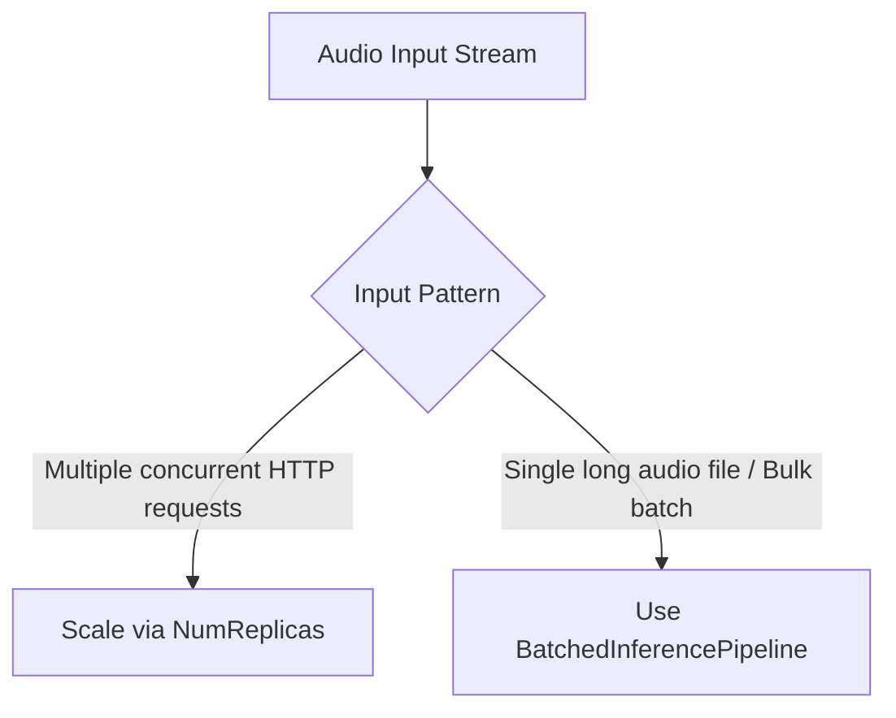

# API Reference

This document provides a comprehensive reference for the core configuration options, parameter behaviors, and data structures in **FasterWhisper.NET**.

---

## WhisperOptions

The `WhisperOptions` class controls model decoding, beam search strategies, temperature fallback routines, audio preprocessing, text post-filtering, and multipass verification.

### Generation and Decoding Parameters

| Option | Type | Default | Description and Usage Recommendations |
| :--- | :--- | :--- | :--- |
| **`BeamSize`** | `int` | `5` | **Beam Search Width**: Number of active candidate hypotheses tracked at each step. Increasing this (e.g., to `10`) improves accuracy on complex audio at the expense of compute time. Set to `1` for greedy decoding (recommended for real-time streaming or constrained CPU environments). |
| **`Patience`** | `float` | `1.0` | **Beam Search Patience**: Multiplier for beam search termination criteria. A value of `1.0` uses default stopping conditions; values greater than `1.0` force extended exploration, reducing premature sentence truncation. |
| **`LengthPenalty`** | `float` | `1.0` | **Length Bias Factor**: Exponential penalty applied to sequence length. Values `< 1.0` favor shorter segments; values `> 1.0` encourage longer output. |
| **`RepetitionPenalty`** | `float` | `1.0` | **Repetition Penalty**: Penalizes previously generated tokens to prevent repetitive loops. A value of `1.0` applies no penalty; values between `1.1` and `1.3` help resolve cyclic hallucinations. |
| **`NoRepeatNgramSize`** | `int` | `0` | **N-Gram Repetition Filter**: Blocks generation of identical token sequences of this length within the same segment. Set to `0` to disable. |
| **`MaxLength`** | `int` | `448` | **Maximum Segment Tokens**: Hard upper limit of generated tokens (sub-words and punctuation) per 30-second audio window. |
| **`MaxNewTokens`** | `int` | `0` | **Maximum New Tokens**: Limits generated tokens for the current chunk. When set to `0`, `MaxLength` is used as the ceiling. |
| **`SamplingTopK`** | `int` | `1` | **Top-K Sampling**: Restricts token candidate selection to the top K probabilities. Set to `1` for deterministic decoding; set to `0` to sample across the full distribution when temperature is non-zero. |
| **`SamplingTemperature`** | `float` | `1.0` | **Softmax Temperature**: Controls sampling entropy when non-zero. Near `0.0` yields deterministic results; higher values introduce variability when fallback retries occur. |
| **`BestOf`** | `int` | `5` | **Candidate Sampling Count**: Number of parallel candidate sequences evaluated when `SamplingTemperature > 0.0`. The sequence with the highest average log-probability is selected. |
| **`NumHypotheses`** | `int` | `1` | **Hypothesis Return Count**: Number of transcription hypotheses returned in the final segment structure. |
| **`ReturnScores`** | `bool` | `true` | **Log-Probability Output**: When enabled, includes average token log-likelihood scores in the returned segment. |
| **`ReturnNoSpeechProb`** | `bool` | `true` | **No-Speech Probability**: When enabled, calculates and includes the model's confidence that the window contains background noise or silence. |
| **`WithoutTimestamps`** | `bool` | `false` | **Timestamp Suppression**: Suppresses timestamp token generation, returning text-only output with reduced decoding latency. |

### Temperature Fallback Configuration

| Option | Type | Default | Description and Usage Recommendations |
| :--- | :--- | :--- | :--- |
| **`Temperatures`** | `float[]` | `[0.0, 0.2, 0.4, 0.6, 0.8, 1.0]` | **Fallback Sequence**: When a segment fails validation thresholds (compression ratio or log-probability), the engine automatically retries decoding with successive temperatures from this sequence to break repetitive loops. |
| **`PromptResetOnTemperature`** | `float` | `0.5` | **Context Reset Threshold**: If fallback retries reach or exceed this temperature, previous chunk context is discarded to avoid propagating corrupted states. |

### Diagnostic and Validation Thresholds

| Option | Type | Default | Description and Usage Recommendations |
| :--- | :--- | :--- | :--- |
| **`LogProbThreshold`** | `float` | `-1.0` | **Minimum Log-Probability**: Segments with an average log-probability below this threshold are flagged as low confidence and scheduled for fallback retry or discarded. |
| **`NoSpeechThreshold`** | `float` | `0.6` | **Silence Probability Cutoff**: If the predicted no-speech probability exceeds this value AND log-probability falls below `LogProbThreshold`, the segment is classified as non-speech. |
| **`CompressionRatioThreshold`** | `float` | `2.4` | **Repetition Compression Ceiling**: Transcripts are evaluated via gzip compression. A compression ratio exceeding `2.4` indicates repetitive token looping, triggering a fallback retry. |
| **`HallucinationSilenceThreshold`**| `float` | `0` | **Silent Region Threshold**: Skips token generation across silent regions exceeding this duration (in seconds). Set to `0` to disable. |

### Digital Signal Processing (DSP) and Audio Preprocessing

| Option | Type | Default | Description and Usage Recommendations |
| :--- | :--- | :--- | :--- |
| **`NormalizeAudio`** | `bool` | `true` | **RMS Normalization**: Adjusts input audio signal levels to a standardized -20 dBFS Root Mean Square target for consistent amplitude. |
| **`CutLowFrequencies`** | `bool` | `true` | **High-Pass Filter**: Applies an 80 Hz high-pass filter to eliminate DC offset, mechanical rumble, and low-frequency microphone hum. |
| **`PreEmphasis`** | `bool` | `false` | **High-Frequency Emphasis**: Applies a first-order pre-emphasis filter to enhance sibilant speech clarity in low-bandwidth audio. |
| **`DenoiseAudio`** | `bool` | `false` | **Spectral Noise Gate**: Subtracts stationary background noise (such as HVAC or fan noise) prior to Mel spectrogram extraction. |

### Prompts, Hotwords, and Text Formatting

| Option | Type | Default | Description and Usage Recommendations |
| :--- | :--- | :--- | :--- |
| **`InitialPrompt`** | `string?` | `null` | **Contextual Prompt**: Guides transcription formatting, acronym casing, and terminology style across the audio stream. |
| **`Prefix`** | `string?` | `null` | **Chunk Prefix**: Pre-populates the initial segment output, forcing the decoder to continue generation from the provided prefix. |
| **`Hotwords`** | `string?` | `null` | **Key Term Boosting**: Comma-separated list of domain-specific words or phrases prioritized across segment boundaries. |
| **`VocabularyBias`** | `Dictionary<string, float>?` | `null` | **Logit Probability Bias**: Map of token strings to positive or negative float bias values, modifying token selection probabilities directly. |
| **`ConditionOnPreviousText`** | `bool` | `true` | **Context Continuity**: Passes the previous 30-second transcript into the subsequent window prompt. Disable if errors propagate between windows. |
| **`FilterFillerWords`** | `bool` | `false` | **Filler Word Removal**: Post-processing filter that removes verbal hesitations ("uh", "um", "ah", "eh", "mhm"). |
| **`PruneStutters`** | `bool` | `false` | **Stutter Pruning**: Post-processing filter that eliminates consecutive duplicate words. |
| **`RestoreTextFormatting`** | `bool` | `false` | **Grammar Formatting**: Applies rule-based capitalization and punctuation formatting to output segments. |

### Word-Level Timestamps and Alignment

| Option | Type | Default | Description and Usage Recommendations |
| :--- | :--- | :--- | :--- |
| **`WordTimestamps`** | `bool` | `false` | **Cross-Attention Alignment**: Extracts precise start and end boundaries for each word via cross-attention matrix alignment. |
| **`MedianFilterWidth`** | `int` | `7` | **Alignment Smoothing**: Kernel width (in frames) of the median filter applied to the cross-attention matrix. Must be an odd integer. |
| **`PrependPunctuations`** | `string` | `"\"'“¿([{-"` | **Left-Bound Punctuation**: Characters bound to the beginning of subsequent words. |
| **`AppendPunctuations`** | `string` | `"\".。,，!！?？:：)”)]}、"` | **Right-Bound Punctuation**: Characters bound to the end of preceding words. |

### Multi-Pass and Advanced Modes

| Option | Type | Default | Description and Usage Recommendations |
| :--- | :--- | :--- | :--- |
| **`Multilingual`** | `bool` | `false` | **Per-Chunk Language Detection**: Evaluates language independently for each 30-second chunk rather than locking to the initial detection. |
| **`AdaptiveBeamSize`** | `bool` | `true` | **Dynamic Search Width**: Uses greedy decoding (beam size 1) at temperature 0 and elevates to full `BeamSize` during fallback retries to conserve resources. |
| **`ClipTimestamps`** | `List<(float, float)>?` | `null` | **Temporal Clipping**: Restricts model processing exclusively to specified (start, end) timestamp intervals in seconds. |
| **`MultiPassEnabled`** | `bool` | `false` | **Two-Pass Verification**: Triggers a secondary transcription pass for segments whose average confidence score falls below `MultiPassConfidenceThreshold`. |
| **`MultiPassConfidenceThreshold`** | `float` | `0.6` | **Secondary Pass Trigger**: Segments with confidence below this threshold are queued for re-transcription. |
| **`MultiPassBeamSize`** | `int` | `10` | **Secondary Pass Beam Width**: Elevated beam search width used during the second pass to maximize accuracy on difficult segments. |

---

## VadOptions

The `VadOptions` class configures the Silero Voice Activity Detector (VAD v5 ONNX). VAD partitions audio into active speech intervals, stripping background silence before inference.

| Option | Type | Default | Description and Usage Recommendations |
| :--- | :--- | :--- | :--- |
| **`Enabled`** | `bool` | `false` | **Toggle VAD**: Enables Silero VAD v5 ONNX audio segmentation. Recommended for long-form audio to reduce compute time and eliminate silence hallucinations. |
| **`Threshold`** | `float` | `0.5` | **Speech Probability Threshold**: Probability value (0.0 to 1.0) above which an audio frame is classified as active speech. Lower values (e.g., `0.35`) capture quiet speech; higher values (e.g., `0.65`) filter background acoustic noise. |
| **`MinSpeechDurationMs`** | `int` | `250` | **Minimum Speech Duration**: Audio segments shorter than this threshold (in milliseconds) are discarded as transient noise (e.g., clicks, mic pops). |
| **`MinSilenceDurationMs`** | `int` | `2000` | **Silence Boundary Margin**: Minimum silence interval (in milliseconds) required to split speech into separate segments. Lowering this (e.g., to `500`–`1000`) creates smaller, sentence-level boundaries. |

---

## WhisperSegment

The primary result structure returned by `model.Transcribe()`. Represents an individual transcribed segment with timestamps, confidence scores, and word-level metadata.

| Property | Type | Description |
| :--- | :--- | :--- |
| **`Text`** | `string` | The transcribed text content of the segment, trimmed of extraneous whitespace. |
| **`Start`** | `float` | Start timestamp of the segment in seconds. |
| **`End`** | `float` | End timestamp of the segment in seconds. |
| **`Score`** | `float` | Average log-probability score of generated tokens. Values closer to `0.0` indicate high confidence. |
| **`NoSpeechProb`** | `float` | Probability (0.0 to 1.0) that the audio segment contains non-speech or background noise. |
| **`Tokens`** | `int[]` | Array of raw integer token identifiers generated by the model tokenizer. |
| **`Words`** | `List<WhisperWord>` | Collection of individual word timestamp structures. Populated when `WordTimestamps = true`. |

---

## WhisperWord

Represents an individual aligned word within a `WhisperSegment`.

| Property | Type | Description |
| :--- | :--- | :--- |
| **`Word`** | `string` | Text content of the word, including attached punctuation. |
| **`Start`** | `float` | Start timestamp of the word in seconds. |
| **`End`** | `float` | End timestamp of the word in seconds. |
| **`Probability`** | `float` | Alignment confidence score (0.0 to 1.0) calculated from cross-attention weights. |

---

## Architectural Decision Framework

Use the following architectural guidelines to determine which SDK features to apply for common deployment patterns:

### High-Concurrency Web APIs vs. Bulk Archive Ingestion

```mermaid
graph TD
    Source[Audio Input Stream] --> Check{Input Pattern}
    Check -->|Multiple concurrent HTTP requests| Replicas[Scale via NumReplicas]
    Check -->|Single long audio file / Bulk batch| Batching[Use BatchedInferencePipeline]
```

- **Multi-Replica Scaling (`NumReplicas`)**: Ideal for web servers (e.g., ASP.NET Core) receiving independent concurrent audio requests. CTranslate2 shares model weights across replicas in memory, minimizing RAM and VRAM expansion while enabling parallel inference.
- **Batched Inference (`BatchedInferencePipeline`)**: Ideal for large audio files or background queue workers. The pipeline partitions long recordings with VAD and evaluates batches concurrently, yielding up to a 60% reduction in processing time on CUDA devices.

### Mitigating Repetition Loops and Hallucinations

1. **Maintain Default Temperature Fallback**: Retrying failed segments across increasing temperatures (`0.0`, `0.2`, `0.4`, ...) introduces controlled variance to escape autoregressive repetition loops.
2. **Enable Silero VAD**: Removing silence prevents the decoder from attempting to generate text from ambient noise.
3. **Set `HallucinationSilenceThreshold`**: Restricts the maximum time the model may spend decoding low-energy audio regions.
